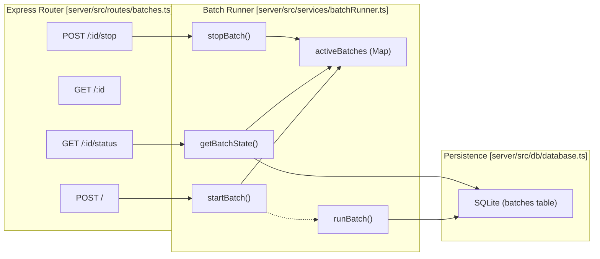
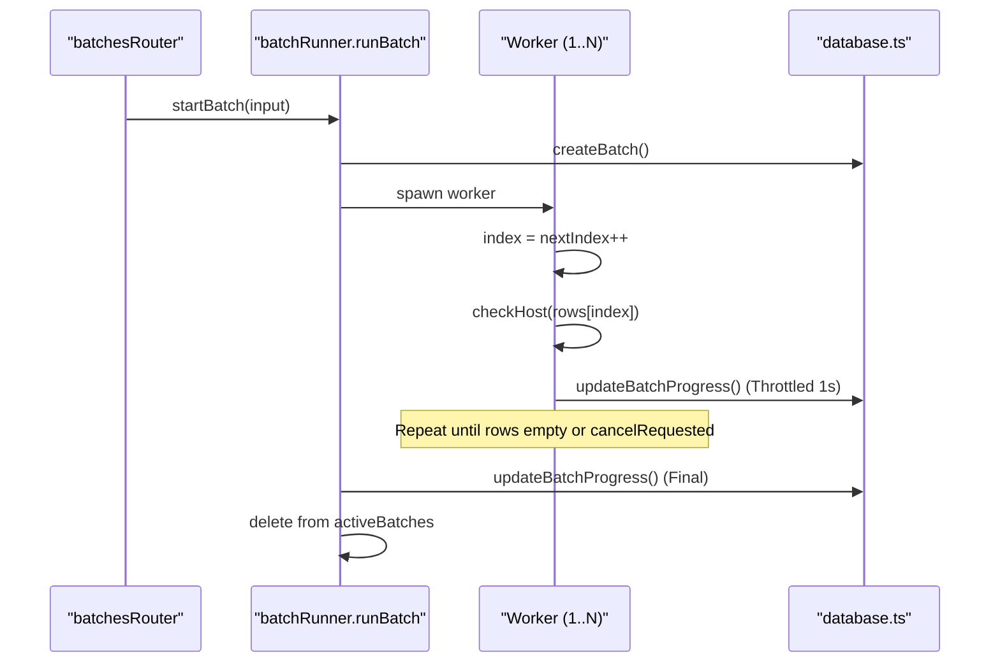

# Batch Endpoints
Relevant source files
- [server/src/routes/batches.ts](https://github.com/manuxio/batch-dns-checker/blob/ba4e9a28/server/src/routes/batches.ts)
- [server/src/services/batchRunner.ts](https://github.com/manuxio/batch-dns-checker/blob/ba4e9a28/server/src/services/batchRunner.ts)
- [server/src/types.ts](https://github.com/manuxio/batch-dns-checker/blob/ba4e9a28/server/src/types.ts)

The Batch API provides a set of RESTful endpoints for managing asynchronous DNS verification jobs. These endpoints handle the full lifecycle of a batch: from multi-format file ingestion and concurrent execution to real-time progress monitoring, domain-based aggregation, and data export.

## Overview of Data Flow

When a file is uploaded via `POST /api/batches`, the server parses the content, validates the rows, and initializes a `Batch` entity. The execution is handled by a background worker pool with a configurable concurrency limit (`DNS_HOST_CONCURRENCY`). Clients are expected to poll the status endpoint to update the UI until the batch reaches a terminal state.

### Code Entity Mapping: API to Service Layer

This diagram illustrates how the Express router maps HTTP requests to the underlying service functions and data structures.

**Batch Execution & State Mapping**



**Sources:**[server/src/routes/batches.ts1-174](https://github.com/manuxio/batch-dns-checker/blob/ba4e9a28/server/src/routes/batches.ts#L1-L174)[server/src/services/batchRunner.ts1-260](https://github.com/manuxio/batch-dns-checker/blob/ba4e9a28/server/src/services/batchRunner.ts#L1-L260)

---

## Endpoint Reference

### 1. List Batches

`GET /api/batches`

Returns a list of recent batch summaries from the database. It uses `listBatches()` which typically returns the last 10 records.

- **Response:**`200 OK`
- `batches`: Array of `BatchSummary` objects.

**Sources:**[server/src/routes/batches.ts22-25](https://github.com/manuxio/batch-dns-checker/blob/ba4e9a28/server/src/routes/batches.ts#L22-L25)[server/src/db/database.ts4](https://github.com/manuxio/batch-dns-checker/blob/ba4e9a28/server/src/db/database.ts#L4-L4)

### 2. Create and Start Batch

`POST /api/batches`

Uploads a CSV or XLSX file and starts the DNS verification process.

- **Request Body:**`multipart/form-data`
- `file`: The CSV or XLSX file.
- `name` (optional): A custom name for the batch.
- **Processing Logic:**
1. Uses `multer` for memory storage [server/src/routes/batches.ts15-18](https://github.com/manuxio/batch-dns-checker/blob/ba4e9a28/server/src/routes/batches.ts#L15-L18)
2. Calls `parseUpload` to extract rows [server/src/routes/batches.ts36-40](https://github.com/manuxio/batch-dns-checker/blob/ba4e9a28/server/src/routes/batches.ts#L36-L40)
3. If no valid rows are found, returns `400 NoValidRows`[server/src/routes/batches.ts47-53](https://github.com/manuxio/batch-dns-checker/blob/ba4e9a28/server/src/routes/batches.ts#L47-L53)
4. Invokes `startBatch`, which assigns a UUID and triggers the background `runBatch` worker [server/src/services/batchRunner.ts74-126](https://github.com/manuxio/batch-dns-checker/blob/ba4e9a28/server/src/services/batchRunner.ts#L74-L126)
- **Response:**`201 Created`
- Returns the `Batch` object.
- Includes a `warning: "softLimitExceeded"` if `validRows.length > config.softMaxRecords`[server/src/routes/batches.ts69-73](https://github.com/manuxio/batch-dns-checker/blob/ba4e9a28/server/src/routes/batches.ts#L69-L73)

### 3. Get Batch Details

`GET /api/batches/:id`

Retrieves the full state of a batch, including all `results` and `invalidRows`.

- **Logic:** Calls `getBatchState(id)`, which checks the in-memory `activeBatches` map first. If not found (meaning the batch is finished or the server restarted), it queries the SQLite database [server/src/services/batchRunner.ts254-258](https://github.com/manuxio/batch-dns-checker/blob/ba4e9a28/server/src/services/batchRunner.ts#L254-L258)
- **Response:**`200 OK` or `404 BatchNotFound`.

### 4. Poll Batch Status

`GET /api/batches/:id/status`

A lightweight endpoint designed for high-frequency polling (e.g., every 1.5s in the React UI).

- **Response Shape:**
```
{
  id: string;
  status: BatchStatus;
  total: number;
  completed: number;
  counts: { ok: number; warning: number; error: number; cancelled: number; };
}
```

**Sources:**[server/src/routes/batches.ts87-100](https://github.com/manuxio/batch-dns-checker/blob/ba4e9a28/server/src/routes/batches.ts#L87-L100)[server/src/types.ts98-103](https://github.com/manuxio/batch-dns-checker/blob/ba4e9a28/server/src/types.ts#L98-L103)

### 5. Get Grouped Results

`GET /api/batches/:id/groups`

Aggregates the batch results by their registrable domain (e.g., `mail.google.com` and `google.com` both fall under `google.com`).

- **Logic:** Uses `groupByDomain(batch)`[server/src/routes/batches.ts109](https://github.com/manuxio/batch-dns-checker/blob/ba4e9a28/server/src/routes/batches.ts#L109-L109)
- **Response:**`{ groups: DomainGroup[] }`.

### 6. Stop Batch

`POST /api/batches/:id/stop`

Requests cooperative cancellation of a running batch.

- **Logic:** Sets the `cancelRequested` flag to `true` in the `ActiveBatch` object [server/src/services/batchRunner.ts228-233](https://github.com/manuxio/batch-dns-checker/blob/ba4e9a28/server/src/services/batchRunner.ts#L228-L233) The worker loop checks this flag before processing the next row [server/src/services/batchRunner.ts154](https://github.com/manuxio/batch-dns-checker/blob/ba4e9a28/server/src/services/batchRunner.ts#L154-L154)
- **Response:**`202 Accepted`.

### 7. Rerun Batch

`POST /api/batches/:id/rerun`

Clones an existing batch's input rows and starts a new execution.

- **Logic:** Extracts `hostname`, `type`, and `expectedValue` from the source results and calls `startBatch`[server/src/services/batchRunner.ts209-225](https://github.com/manuxio/batch-dns-checker/blob/ba4e9a28/server/src/services/batchRunner.ts#L209-L225)
- **Response:**`201 Created` with the new batch ID.

### 8. Export Results

`GET /api/batches/:id/export?format=xlsx|csv`

Generates a downloadable file of the batch results.

- **Formats:**
- `csv`: Includes a UTF-8 BOM for Excel compatibility [server/src/routes/batches.ts160](https://github.com/manuxio/batch-dns-checker/blob/ba4e9a28/server/src/routes/batches.ts#L160-L160)
- `xlsx`: Generates a spreadsheet with formatted headers and per-nameserver detail columns [server/src/routes/batches.ts172](https://github.com/manuxio/batch-dns-checker/blob/ba4e9a28/server/src/routes/batches.ts#L172-L172)
- **Headers:** Sets `Content-Disposition: attachment` with a sanitized filename based on the batch name [server/src/routes/batches.ts151-171](https://github.com/manuxio/batch-dns-checker/blob/ba4e9a28/server/src/routes/batches.ts#L151-L171)

---

## Implementation Details: Batch Runner

The `batchRunner.ts` module manages the lifecycle of a batch using an in-memory `ActiveBatch` interface for performance and a SQLite database for persistence.

### Worker Pool Implementation

The `runBatch` function implements a worker pool using `Promise.all` and a shared `nextIndex` pointer to process rows concurrently.

**Batch Worker Concurrency Flow**



**Sources:**[server/src/services/batchRunner.ts140-202](https://github.com/manuxio/batch-dns-checker/blob/ba4e9a28/server/src/services/batchRunner.ts#L140-L202)[server/src/config.ts1-50](https://github.com/manuxio/batch-dns-checker/blob/ba4e9a28/server/src/config.ts#L1-L50)

### Error Handling & Status Codes

| Error Code | HTTP Status | Description |
| --- | --- | --- |
| `noFileUploaded` | 400 | No file found in the multipart request [server/src/routes/batches.ts30](https://github.com/manuxio/batch-dns-checker/blob/ba4e9a28/server/src/routes/batches.ts#L30-L30) |
| `parseFailed` | 400 | File is corrupted or has an invalid structure [server/src/routes/batches.ts43](https://github.com/manuxio/batch-dns-checker/blob/ba4e9a28/server/src/routes/batches.ts#L43-L43) |
| `noValidRows` | 400 | File parsed correctly but contained no valid checkable rows [server/src/routes/batches.ts49](https://github.com/manuxio/batch-dns-checker/blob/ba4e9a28/server/src/routes/batches.ts#L49-L49) |
| `batchNotFound` | 404 | The requested ID does not exist in memory or DB [server/src/routes/batches.ts80](https://github.com/manuxio/batch-dns-checker/blob/ba4e9a28/server/src/routes/batches.ts#L80-L80) |
| `noRunningBatch` | 404 | Attempted to stop a batch that is not currently active [server/src/routes/batches.ts126](https://github.com/manuxio/batch-dns-checker/blob/ba4e9a28/server/src/routes/batches.ts#L126-L126) |

**Sources:**[server/src/routes/batches.ts28-140](https://github.com/manuxio/batch-dns-checker/blob/ba4e9a28/server/src/routes/batches.ts#L28-L140)