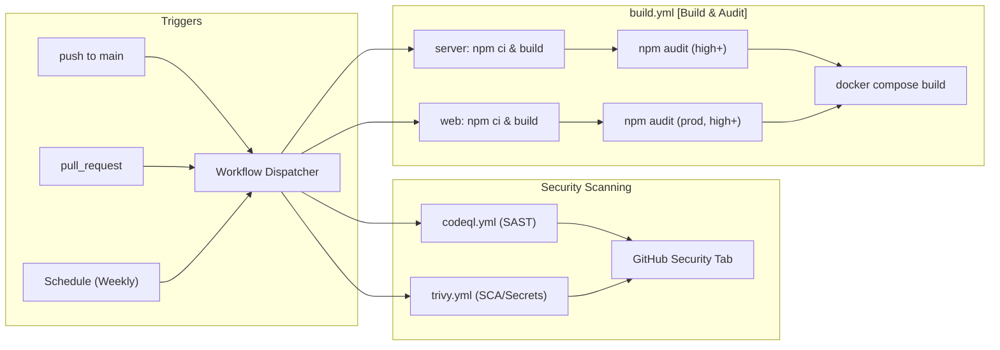
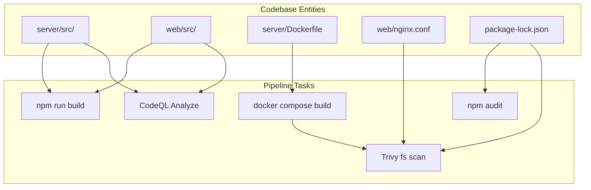

# CI/CD Pipelines & Security Scanning
Relevant source files
- [.github/workflows/build.yml](https://github.com/manuxio/batch-dns-checker/blob/ba4e9a28/.github/workflows/build.yml)
- [.github/workflows/codeql.yml](https://github.com/manuxio/batch-dns-checker/blob/ba4e9a28/.github/workflows/codeql.yml)
- [.github/workflows/trivy.yml](https://github.com/manuxio/batch-dns-checker/blob/ba4e9a28/.github/workflows/trivy.yml)

The **batch-dns-checker** project employs a multi-layered CI/CD strategy hosted on GitHub Actions. This infrastructure ensures code quality through TypeScript compilation, manages dependency health via automated audits, and maintains a robust security posture through Static Application Security Testing (SAST) and container-level vulnerability scanning.

## Pipeline Architecture Overview

The automation suite consists of three primary workflows triggered by pushes to `main`, pull requests, and weekly schedules. These workflows validate both the `server` and `web` components independently before verifying the integrated `docker-compose` build.

### Workflow Data Flow

The following diagram illustrates how code changes propagate through the various validation gates.

**CI/CD Validation Flow**

**Sources:**[.github/workflows/build.yml1-60](https://github.com/manuxio/batch-dns-checker/blob/ba4e9a28/.github/workflows/build.yml#L1-L60)[.github/workflows/codeql.yml1-39](https://github.com/manuxio/batch-dns-checker/blob/ba4e9a28/.github/workflows/codeql.yml#L1-L39)[.github/workflows/trivy.yml1-50](https://github.com/manuxio/batch-dns-checker/blob/ba4e9a28/.github/workflows/trivy.yml#L1-L50)

---

## 1. Build & Dependency Audit (`build.yml`)

The `build.yml` workflow acts as the primary continuous integration gate. It ensures that the TypeScript source code in both the backend and frontend is free of compilation errors and that no known high-severity vulnerabilities exist in the dependency tree.

### Server Job

- **Working Directory:**`server`[.github/workflows/build.yml18](https://github.com/manuxio/batch-dns-checker/blob/ba4e9a28/.github/workflows/build.yml#L18-L18)
- **Environment:** Node.js 20 [.github/workflows/build.yml23](https://github.com/manuxio/batch-dns-checker/blob/ba4e9a28/.github/workflows/build.yml#L23-L23)
- **Operations:** Executes `npm ci` for clean installation and `npm run build` to verify the `tsc` compilation of the Express backend [.github/workflows/build.yml26-28](https://github.com/manuxio/batch-dns-checker/blob/ba4e9a28/.github/workflows/build.yml#L26-L28)
- **Audit:** Runs `npm audit --audit-level=high`. This is configured with `continue-on-error: true` to allow builds to proceed while still reporting vulnerabilities in the GitHub Actions log [.github/workflows/build.yml30-31](https://github.com/manuxio/batch-dns-checker/blob/ba4e9a28/.github/workflows/build.yml#L30-L31)

### Web Job

- **Working Directory:**`web`[.github/workflows/build.yml38](https://github.com/manuxio/batch-dns-checker/blob/ba4e9a28/.github/workflows/build.yml#L38-L38)
- **Operations:** Similar to the server, it performs a full build of the Vite/React application [.github/workflows/build.yml46-48](https://github.com/manuxio/batch-dns-checker/blob/ba4e9a28/.github/workflows/build.yml#L46-L48)
- **Audit:** Uses `npm audit --omit=dev --audit-level=high` to focus specifically on production dependencies that are bundled into the client-side assets [.github/workflows/build.yml50-51](https://github.com/manuxio/batch-dns-checker/blob/ba4e9a28/.github/workflows/build.yml#L50-L51)

### Docker Job

- **Dependency:** Runs after the individual builds to ensure image consistency [.github/workflows/build.yml53-60](https://github.com/manuxio/batch-dns-checker/blob/ba4e9a28/.github/workflows/build.yml#L53-L60)
- **Action:** Executes `docker compose build` to validate the `Dockerfile` instructions for both `server` and `web` containers [.github/workflows/build.yml59](https://github.com/manuxio/batch-dns-checker/blob/ba4e9a28/.github/workflows/build.yml#L59-L59)

**Sources:**[.github/workflows/build.yml1-60](https://github.com/manuxio/batch-dns-checker/blob/ba4e9a28/.github/workflows/build.yml#L1-L60)

---

## 2. Static Analysis with CodeQL (`codeql.yml`)

The project uses GitHub's **CodeQL** engine to perform deep semantic analysis of the JavaScript and TypeScript codebases.

### Implementation Details

- **Language:** Target is set to `javascript-typescript`[.github/workflows/codeql.yml28](https://github.com/manuxio/batch-dns-checker/blob/ba4e9a28/.github/workflows/codeql.yml#L28-L28)
- **Query Suite:** Uses the `security-and-quality` suite [.github/workflows/codeql.yml30](https://github.com/manuxio/batch-dns-checker/blob/ba4e9a28/.github/workflows/codeql.yml#L30-L30) This includes standard security checks (SQL injection, XSS, etc.) plus maintainability and reliability queries.
- **Scanning Schedule:** In addition to PR triggers, a weekly scan runs every Monday at 06:00 UTC to catch new vulnerabilities identified in existing code patterns [.github/workflows/codeql.yml9](https://github.com/manuxio/batch-dns-checker/blob/ba4e9a28/.github/workflows/codeql.yml#L9-L9)

The results are uploaded as SARIF (Static Analysis Results Interchange Format) data to the repository's **Security** tab [.github/workflows/codeql.yml19](https://github.com/manuxio/batch-dns-checker/blob/ba4e9a28/.github/workflows/codeql.yml#L19-L19)

**Sources:**[.github/workflows/codeql.yml1-39](https://github.com/manuxio/batch-dns-checker/blob/ba4e9a28/.github/workflows/codeql.yml#L1-L39)

---

## 3. Vulnerability & Secret Scanning (`trivy.yml`)

**Trivy** is utilized for comprehensive filesystem scanning, focusing on three specific areas: known vulnerabilities (SCA), exposed secrets, and infrastructure-as-code (IaC) misconfigurations.

### Scan Configuration

The workflow uses `aquasecurity/trivy-action` to inspect the repository root [.github/workflows/trivy.yml25](https://github.com/manuxio/batch-dns-checker/blob/ba4e9a28/.github/workflows/trivy.yml#L25-L25)

| Feature | Configuration | Purpose |
| --- | --- | --- |
| **Scan Type** | `fs` (Filesystem) | Scans the source code and configuration files [.github/workflows/trivy.yml27](https://github.com/manuxio/batch-dns-checker/blob/ba4e9a28/.github/workflows/trivy.yml#L27-L27) |
| **Scanners** | `vuln, secret, misconfig` | Detects CVEs, API keys/passwords, and Docker/Nginx config issues [.github/workflows/trivy.yml28](https://github.com/manuxio/batch-dns-checker/blob/ba4e9a28/.github/workflows/trivy.yml#L28-L28) |
| **Severities** | `CRITICAL, HIGH, MEDIUM` | Filters the reporting to actionable security risks [.github/workflows/trivy.yml31](https://github.com/manuxio/batch-dns-checker/blob/ba4e9a28/.github/workflows/trivy.yml#L31-L31) |
| **DB Source** | `public.ecr.aws/aquasecurity/trivy-db` | Uses an ECR mirror to avoid GitHub rate limits during scheduled runs [.github/workflows/trivy.yml34](https://github.com/manuxio/batch-dns-checker/blob/ba4e9a28/.github/workflows/trivy.yml#L34-L34) |

### Fail-Gate Mechanism

The workflow implements a two-stage scan:

1. **Reporting Stage:** Generates a `trivy-results.sarif` file and uploads it to GitHub Security [.github/workflows/trivy.yml29-40](https://github.com/manuxio/batch-dns-checker/blob/ba4e9a28/.github/workflows/trivy.yml#L29-L40)
2. **Gate Stage:** A second pass outputs a human-readable table to the console. While currently set to `exit-code: '0'` (non-blocking), it is configured to isolate `HIGH` and `CRITICAL` vulnerabilities for manual review [.github/workflows/trivy.yml42-49](https://github.com/manuxio/batch-dns-checker/blob/ba4e9a28/.github/workflows/trivy.yml#L42-L49)

**Sources:**[.github/workflows/trivy.yml1-50](https://github.com/manuxio/batch-dns-checker/blob/ba4e9a28/.github/workflows/trivy.yml#L1-L50)

---

## Code-to-Pipeline Mapping

The following diagram maps specific codebase entities to the pipeline steps that validate them.

**Entity Validation Mapping**

**Sources:**[.github/workflows/build.yml28-59](https://github.com/manuxio/batch-dns-checker/blob/ba4e9a28/.github/workflows/build.yml#L28-L59)[.github/workflows/codeql.yml28-36](https://github.com/manuxio/batch-dns-checker/blob/ba4e9a28/.github/workflows/codeql.yml#L28-L36)[.github/workflows/trivy.yml27-48](https://github.com/manuxio/batch-dns-checker/blob/ba4e9a28/.github/workflows/trivy.yml#L27-L48)