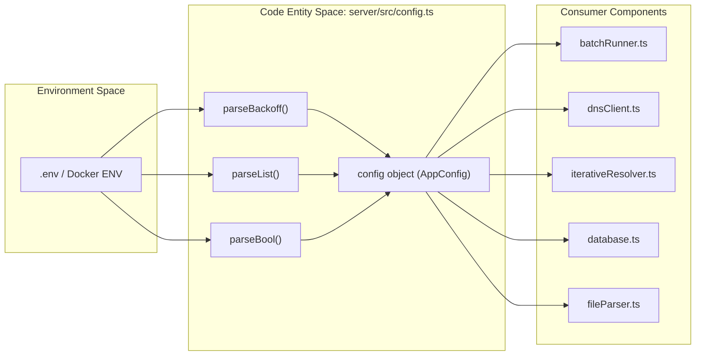
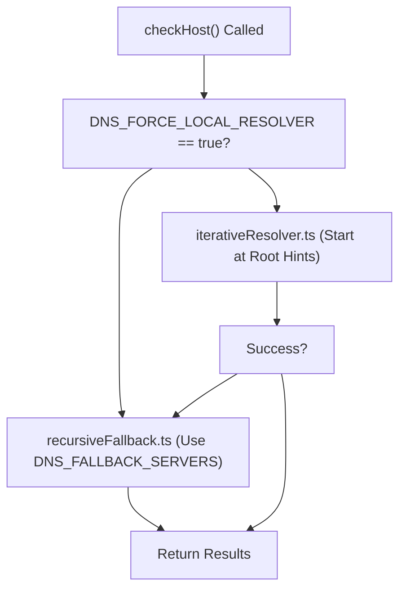

# Configuration Reference
Relevant source files
- [.env.example](https://github.com/manuxio/batch-dns-checker/blob/ba4e9a28/.env.example)
- [docker-compose.yml](https://github.com/manuxio/batch-dns-checker/blob/ba4e9a28/docker-compose.yml)
- [server/src/config.ts](https://github.com/manuxio/batch-dns-checker/blob/ba4e9a28/server/src/config.ts)

This page provides a comprehensive technical reference for the environment variables and runtime configuration that govern the behavior of the CONI SVC DNS Checker. The application uses a centralized configuration pattern to manage everything from network timeouts and concurrency to data retention and resolution strategies.

## Overview

The server's configuration is managed in `server/src/config.ts`, where environment variables are parsed and cast into a typed `AppConfig` object [server/src/config.ts7-36](https://github.com/manuxio/batch-dns-checker/blob/ba4e9a28/server/src/config.ts#L7-L36) These settings affect three primary subsystems:

1. **DNS Engine:** Controls how queries are dispatched, timed out, and retried.
2. **Batch Runner:** Manages the concurrency of asynchronous processing.
3. **Persistence/Storage:** Defines where data is kept and how much is retained.

### Configuration Data Flow

The following diagram illustrates how environment variables propagate through the system components.

**System Configuration Flow**

**Sources:**[server/src/config.ts7-36](https://github.com/manuxio/batch-dns-checker/blob/ba4e9a28/server/src/config.ts#L7-L36)[docker-compose.yml5-17](https://github.com/manuxio/batch-dns-checker/blob/ba4e9a28/docker-compose.yml#L5-L17)

---

## Environment Variables Reference

### Network & Infrastructure

| Variable | Default | Description |
| --- | --- | --- |
| `PORT` | `3001` | The TCP port the Express server listens on within the container [server/src/config.ts8](https://github.com/manuxio/batch-dns-checker/blob/ba4e9a28/server/src/config.ts#L8-L8) |
| `DATA_DIR` | `./data` | Filesystem path for the SQLite database and temporary storage. In Docker, this is mapped to a persistent volume [docker-compose.yml19](https://github.com/manuxio/batch-dns-checker/blob/ba4e9a28/docker-compose.yml#L19-L19) |
| `WEB_PORT` | `8080` | (Web Container Only) The host port used to access the UI via Nginx [docker-compose.yml31](https://github.com/manuxio/batch-dns-checker/blob/ba4e9a28/docker-compose.yml#L31-L31) |

### DNS Resolution Tuning

These variables directly impact the `dnsClient.ts` and `iterativeResolver.ts` logic.

| Variable | Default | Description |
| --- | --- | --- |
| `DNS_TIMEOUT_MS` | `5000` | Per-query timeout. If a nameserver doesn't respond within this window, the query fails or retries [server/src/config.ts11](https://github.com/manuxio/batch-dns-checker/blob/ba4e9a28/server/src/config.ts#L11-L11) |
| `DNS_TRIES` | `2` | Number of attempts for a single DNS query before moving to the next logic step [server/src/config.ts13](https://github.com/manuxio/batch-dns-checker/blob/ba4e9a28/server/src/config.ts#L13-L13) |
| `DNS_MAX_RETRIES` | `10` | Maximum retries for transient resolution errors (e.g., `SERVFAIL` or network blips) [server/src/config.ts17](https://github.com/manuxio/batch-dns-checker/blob/ba4e9a28/server/src/config.ts#L17-L17) |
| `DNS_BACKOFF_MS` | `100,500,1000,2000` | Comma-separated list of milliseconds for exponential/custom backoff between retries [server/src/config.ts19](https://github.com/manuxio/batch-dns-checker/blob/ba4e9a28/server/src/config.ts#L19-L19) |

**Sources:**[server/src/config.ts10-19](https://github.com/manuxio/batch-dns-checker/blob/ba4e9a28/server/src/config.ts#L10-L19)[docker-compose.yml8-12](https://github.com/manuxio/batch-dns-checker/blob/ba4e9a28/docker-compose.yml#L8-L12)

### Resolution Strategy

The application defaults to **Iterative Resolution**, querying root servers and walking the delegation chain. This requires outbound UDP/TCP port 53 access.

| Variable | Default | Description |
| --- | --- | --- |
| `DNS_FORCE_LOCAL_RESOLVER` | `false` | If `true`, disables iterative walking and uses the system's recursive resolver (via `dns.Resolver`) [server/src/config.ts24](https://github.com/manuxio/batch-dns-checker/blob/ba4e9a28/server/src/config.ts#L24-L24) |
| `DNS_FALLBACK_SERVERS` | `[]` | Comma-separated list of IP addresses. If provided, these are used for the recursive fallback path [server/src/config.ts29](https://github.com/manuxio/batch-dns-checker/blob/ba4e9a28/server/src/config.ts#L29-L29) |

**Sources:**[server/src/config.ts20-29](https://github.com/manuxio/batch-dns-checker/blob/ba4e9a28/server/src/config.ts#L20-L29)[.env.example18-26](https://github.com/manuxio/batch-dns-checker/blob/ba4e9a28/.env.example#L18-L26)

### Batch & Resource Limits

| Variable | Default | Description |
| --- | --- | --- |
| `DNS_HOST_CONCURRENCY` | `8` | Number of hostnames processed in parallel within a single batch [server/src/config.ts15](https://github.com/manuxio/batch-dns-checker/blob/ba4e9a28/server/src/config.ts#L15-L15) |
| `SOFT_MAX_RECORDS` | `150` | Threshold for warning the user about batch size. Does not block execution [server/src/config.ts31](https://github.com/manuxio/batch-dns-checker/blob/ba4e9a28/server/src/config.ts#L31-L31) |
| `MAX_UPLOAD_BYTES` | `10485760` | Max file size for CSV/XLSX uploads (default 10MB) [server/src/config.ts33](https://github.com/manuxio/batch-dns-checker/blob/ba4e9a28/server/src/config.ts#L33-L33) |
| `MAX_BATCHES` | `10` | Number of historical batches retained in the SQLite database before pruning [server/src/config.ts35](https://github.com/manuxio/batch-dns-checker/blob/ba4e9a28/server/src/config.ts#L35-L35) |

**Sources:**[server/src/config.ts30-35](https://github.com/manuxio/batch-dns-checker/blob/ba4e9a28/server/src/config.ts#L30-L35)[docker-compose.yml10-17](https://github.com/manuxio/batch-dns-checker/blob/ba4e9a28/docker-compose.yml#L10-L17)

---

## Technical Implementation Details

### Backoff Logic

The `dnsBackoffMs` is parsed by `parseBackoff`[server/src/config.ts38-45](https://github.com/manuxio/batch-dns-checker/blob/ba4e9a28/server/src/config.ts#L38-L45) If more retries are requested than values provided in the list, the system repeats the last value indefinitely until `DNS_MAX_RETRIES` is reached.

### Resolver Selection Logic

The system chooses its resolution path based on `dnsForceLocalResolver`.

**Resolution Strategy Selection**

**Sources:**[server/src/config.ts20-29](https://github.com/manuxio/batch-dns-checker/blob/ba4e9a28/server/src/config.ts#L20-L29)[server/src/dns/dnsChecker.ts](https://github.com/manuxio/batch-dns-checker/blob/ba4e9a28/server/src/dns/dnsChecker.ts)

### Storage and Pruning

The `maxBatches` setting is enforced in `server/src/database.ts`. Every time a new batch is created via `createBatch`, the system executes a pruning query to delete records where the ID is not in the top `N` most recent entries [server/src/database.ts114-118](https://github.com/manuxio/batch-dns-checker/blob/ba4e9a28/server/src/database.ts#L114-L118)

**Sources:**[server/src/database.ts110-120](https://github.com/manuxio/batch-dns-checker/blob/ba4e9a28/server/src/database.ts#L110-L120)[server/src/config.ts35](https://github.com/manuxio/batch-dns-checker/blob/ba4e9a28/server/src/config.ts#L35-L35)