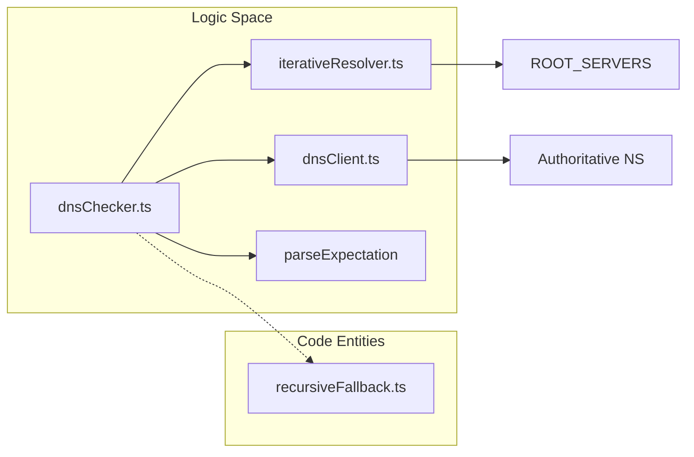
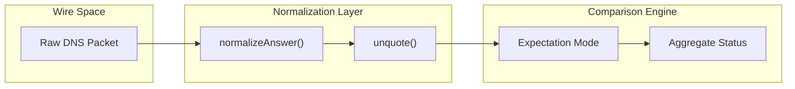

# Core DNS Engine
Relevant source files
- [README.md](https://github.com/manuxio/batch-dns-checker/blob/ba4e9a28/README.md?plain=1)
- [server/src/services/dnsChecker.ts](https://github.com/manuxio/batch-dns-checker/blob/ba4e9a28/server/src/services/dnsChecker.ts)
- [server/src/services/iterativeResolver.ts](https://github.com/manuxio/batch-dns-checker/blob/ba4e9a28/server/src/services/iterativeResolver.ts)

The Core DNS Engine is the heart of the CONI SVC DNS Checker, responsible for verifying that DNS records match expected values across all authoritative sources. Unlike standard resolution, it bypasses intermediate caches by performing iterative discovery starting from the IANA root hints.

## Pipeline Overview

The verification pipeline follows a strict sequence to ensure data freshness and authority. When a hostname is checked, the engine executes the following flow:

1. **Discovery**: The `iterativeResolver` walks the delegation chain (Root → TLD → Authoritative NS) to identify the nameservers for the domain [server/src/services/iterativeResolver.ts136-140](https://github.com/manuxio/batch-dns-checker/blob/ba4e9a28/server/src/services/iterativeResolver.ts#L136-L140)
2. **Direct Query**: The `dnsChecker` queries **each** discovered nameserver individually using the `dnsClient` with the Recursion Desired (`RD`) bit set to `0`[server/src/services/dnsChecker.ts26-27](https://github.com/manuxio/batch-dns-checker/blob/ba4e9a28/server/src/services/dnsChecker.ts#L26-L27)
3. **Validation**: Results from every nameserver are normalized and compared against the user's expectation (supporting `AND`/`OR` logic) [server/src/services/dnsChecker.ts28-29](https://github.com/manuxio/batch-dns-checker/blob/ba4e9a28/server/src/services/dnsChecker.ts#L28-L29)
4. **Fallback**: If the root path is blocked (e.g., by a firewall), the engine switches to `recursiveFallback` using the system's local resolver [server/src/services/dnsChecker.ts275-283](https://github.com/manuxio/batch-dns-checker/blob/ba4e9a28/server/src/services/dnsChecker.ts#L275-L283)

### Engine Component Relationship

The following diagram illustrates how the natural language concepts of "Discovery" and "Verification" map to specific code entities and their interactions.

**DNS Resolution Architecture**

Sources: [server/src/services/dnsChecker.ts21-30](https://github.com/manuxio/batch-dns-checker/blob/ba4e9a28/server/src/services/dnsChecker.ts#L21-L30)[server/src/services/iterativeResolver.ts7-12](https://github.com/manuxio/batch-dns-checker/blob/ba4e9a28/server/src/services/iterativeResolver.ts#L7-L12)[server/src/services/dnsClient.ts1-10](https://github.com/manuxio/batch-dns-checker/blob/ba4e9a28/server/src/services/dnsClient.ts#L1-L10)

## Key Components

### Iterative Resolver

The resolver maintains a `ResolveCache` during a batch to store delegation paths and nameserver IPs [server/src/services/iterativeResolver.ts46-51](https://github.com/manuxio/batch-dns-checker/blob/ba4e9a28/server/src/services/iterativeResolver.ts#L46-L51) It performs a "delegation-chain walk," handling glue records and out-of-bailiwick nameserver resolution via `resolveAddress`[server/src/services/iterativeResolver.ts218-222](https://github.com/manuxio/batch-dns-checker/blob/ba4e9a28/server/src/services/iterativeResolver.ts#L218-L222)

For details, see [Iterative Resolver](/manuxio/batch-dns-checker/2.1-iterative-resolver).

### DNS Compliance Checker

The checker handles the transformation of user input into DNS queries. It includes specialized logic for `POLICY_TYPES` such as SPF, DKIM, and DMARC, which are internally treated as `TXT` queries with specific prefix and marker requirements [server/src/services/dnsChecker.ts56-63](https://github.com/manuxio/batch-dns-checker/blob/ba4e9a28/server/src/services/dnsChecker.ts#L56-L63) It aggregates per-nameserver responses into a final `HostResult` status (ok, warning, or error) [server/src/services/dnsChecker.ts303-310](https://github.com/manuxio/batch-dns-checker/blob/ba4e9a28/server/src/services/dnsChecker.ts#L303-L310)

For details, see [DNS Compliance Checker](/manuxio/batch-dns-checker/2.2-dns-compliance-checker).

### Recursive Fallback & DNS Client

The `dnsClient` is a low-level utility that constructs raw DNS packets. If the `iterativeResolver` throws a `RootUnreachableError`[server/src/services/iterativeResolver.ts58-63](https://github.com/manuxio/batch-dns-checker/blob/ba4e9a28/server/src/services/iterativeResolver.ts#L58-L63) the system triggers `fetchViaLocalResolver`. This fallback uses the Node.js `dns` module to query the environment's configured recursive resolvers [server/src/services/recursiveFallback.ts15-20](https://github.com/manuxio/batch-dns-checker/blob/ba4e9a28/server/src/services/recursiveFallback.ts#L15-L20)

For details, see [Recursive Fallback & DNS Client](/manuxio/batch-dns-checker/2.3-recursive-fallback-and-dns-client).

## Data Normalization and Comparison

To ensure accurate verification, the engine normalizes both the expected value provided by the user and the raw data returned by the nameservers.

| Feature | Code Entity | Responsibility |
| --- | --- | --- |
| **Value Normalization** | `normalizeExpected` | Formats user input (e.g., lowercasing hostnames, unquoting TXT) [server/src/services/dnsChecker.ts88-131](https://github.com/manuxio/batch-dns-checker/blob/ba4e9a28/server/src/services/dnsChecker.ts#L88-L131) |
| **Answer Normalization** | `normalizeAnswer` | Converts raw wire-format data (MX priority, SRV targets) into comparable strings [server/src/services/dnsChecker.ts145-175](https://github.com/manuxio/batch-dns-checker/blob/ba4e9a28/server/src/services/dnsChecker.ts#L145-L175) |
| **Match Logic** | `MatchMode` | Determines if values must satisfy `ALL` (AND) or `ANY` (OR) conditions [server/src/types/index.ts1-20](https://github.com/manuxio/batch-dns-checker/blob/ba4e9a28/server/src/types/index.ts#L1-L20) |

**Data Flow: From Wire to Result**

Sources: [server/src/services/dnsChecker.ts145-175](https://github.com/manuxio/batch-dns-checker/blob/ba4e9a28/server/src/services/dnsChecker.ts#L145-L175)[server/src/services/dnsChecker.ts198-202](https://github.com/manuxio/batch-dns-checker/blob/ba4e9a28/server/src/services/dnsChecker.ts#L198-L202)[server/src/services/dnsChecker.ts303-310](https://github.com/manuxio/batch-dns-checker/blob/ba4e9a28/server/src/services/dnsChecker.ts#L303-L310)