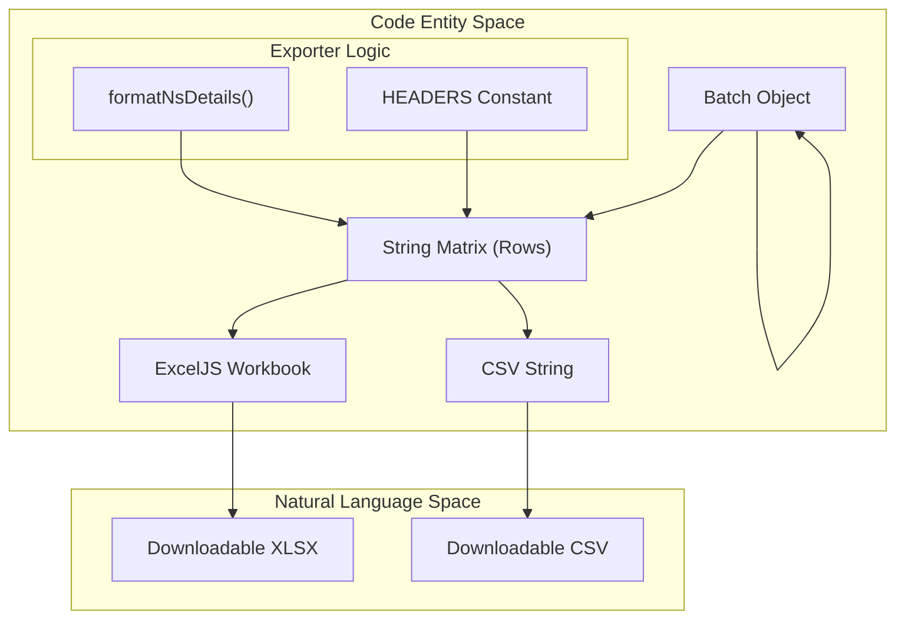
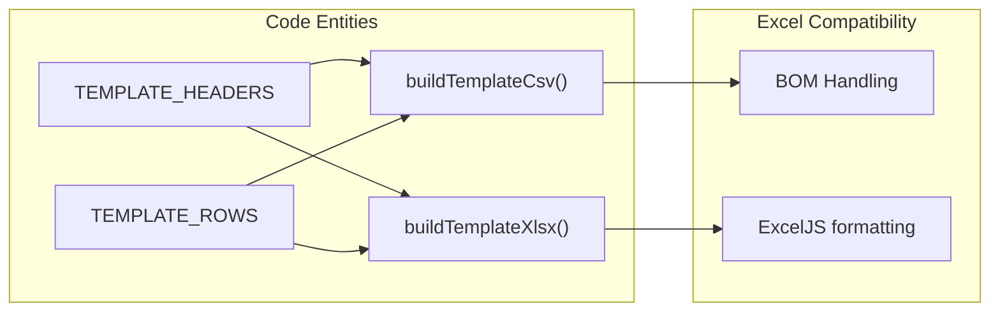

# Export & Templates
Relevant source files
- [server/src/services/exporter.ts](https://github.com/manuxio/batch-dns-checker/blob/ba4e9a28/server/src/services/exporter.ts)
- [server/src/services/template.ts](https://github.com/manuxio/batch-dns-checker/blob/ba4e9a28/server/src/services/template.ts)
- [server/src/types.ts](https://github.com/manuxio/batch-dns-checker/blob/ba4e9a28/server/src/types.ts)

The Export and Templates system provides the mechanism for generating downloadable reports from completed batch jobs and providing users with correctly formatted input templates. The implementation focuses on data integrity, ensuring that every result—including detailed per-nameserver responses and rows that failed initial validation—is preserved in the output.

## Overview

The system is divided into two primary services:

1. **`exporter.ts`**: Handles the transformation of `Batch` objects into `XLSX` (via `ExcelJS`) or `CSV` formats. It flattens complex nested DNS result structures into a tabular format suitable for audit and review.
2. **`template.ts`**: Generates blank or illustrative sample files that mirror the expected input schema of the [File Parsing system](https://github.com/manuxio/batch-dns-checker/blob/ba4e9a28/File Parsing system)

### Data Flow: Batch to Export

The following diagram illustrates how a completed `Batch` object is processed into a matrix and then formatted for different file types.

**Export Transformation Pipeline**

Sources: [server/src/services/exporter.ts1-118](https://github.com/manuxio/batch-dns-checker/blob/ba4e9a28/server/src/services/exporter.ts#L1-L118)[server/src/types.ts121-124](https://github.com/manuxio/batch-dns-checker/blob/ba4e9a28/server/src/types.ts#L121-L124)

## Exporter Implementation

The exporter flattens the `HostResult` type into a 12-column schema. A key feature of the exporter is the inclusion of `invalidRows`, ensuring that if a user uploads a file with 100 rows and 5 are malformed, the export will still contain 100 rows, with the 5 malformed ones marked as `invalid`[server/src/services/exporter.ts59-74](https://github.com/manuxio/batch-dns-checker/blob/ba4e9a28/server/src/services/exporter.ts#L59-L74)

### Column Schema

The `HEADERS` array defines the structure of the exported files:

| Column | Source Field | Description |
| --- | --- | --- |
| `secondaryLevelDomain` | `registrableDomain` | The base domain used for grouping. |
| `hostname` | `hostname` | The original hostname from input. |
| `queryName` | `queryName` | The actual FQDN queried (e.g., `_dmarc.example.com`). |
| `type` | `type` | DNS record type (A, MX, SPF, etc.). |
| `expectedValue` | `expectedValue` | The value(s) the user expected. |
| `matchMode` | `matchMode` | `single`, `all` (&), or `any` (\|). |
| `status` | `status` | `ok`, `warning`, `error`, or `invalid`. |
| `warnings` | `warnings` | Joined list of human-readable warnings. |
| `zone` | `zone` | The DNS zone discovered during resolution. |
| `authoritativeNameservers` | `authoritativeNameservers` | List of NS names queried. |
| `nameserverDetails` | `nsAnswers` | Multi-line string of per-NS outcomes. |
| `message` | `message` | Final summary or error message. |

Sources: [server/src/services/exporter.ts10-23](https://github.com/manuxio/batch-dns-checker/blob/ba4e9a28/server/src/services/exporter.ts#L10-L23)[server/src/services/exporter.ts41-56](https://github.com/manuxio/batch-dns-checker/blob/ba4e9a28/server/src/services/exporter.ts#L41-L56)

### Per-Nameserver Detail Formatting

Because a single check queries multiple authoritative nameservers, the `formatNsDetails` function flattens the `nsAnswers` array into a single string. Each line in the cell follows the pattern:
`{nsName} ({nsIp}) => {status}: {returnedValues} {error}`
Sources: [server/src/services/exporter.ts25-36](https://github.com/manuxio/batch-dns-checker/blob/ba4e9a28/server/src/services/exporter.ts#L25-L36)

### XLSX and CSV Specifics

- **XLSX**: Uses `ExcelJS` to create a workbook. It applies specific column widths, bolds the header row, and enables `wrapText` for the `nameserverDetails` column to maintain readability [server/src/services/exporter.ts79-102](https://github.com/manuxio/batch-dns-checker/blob/ba4e9a28/server/src/services/exporter.ts#L79-L102)
- **CSV**: Implements manual escaping. If a cell contains a comma, quote, or newline, it is wrapped in double quotes, and internal quotes are escaped (`""`) [server/src/services/exporter.ts104-118](https://github.com/manuxio/batch-dns-checker/blob/ba4e9a28/server/src/services/exporter.ts#L104-L118)

## Templates

The `template.ts` module provides the "Golden Standard" for input. It defines `TEMPLATE_HEADERS` as `['hostname', 'type', 'value']`[server/src/services/template.ts8](https://github.com/manuxio/batch-dns-checker/blob/ba4e9a28/server/src/services/template.ts#L8-L8)

### Template Logic

The template includes `TEMPLATE_ROWS` which serves as documentation-by-example, covering:

- **Basic Records**: A, AAAA, MX, SRV, CAA [server/src/services/template.ts12-16](https://github.com/manuxio/batch-dns-checker/blob/ba4e9a28/server/src/services/template.ts#L12-L16)
- **CNAMEs**: Handling alias targets [server/src/services/template.ts20-21](https://github.com/manuxio/batch-dns-checker/blob/ba4e9a28/server/src/services/template.ts#L20-L21)
- **Compound Operators**: Examples of `&` (AND) and `|` (OR) logic [server/src/services/template.ts25-28](https://github.com/manuxio/batch-dns-checker/blob/ba4e9a28/server/src/services/template.ts#L25-L28)
- **Policy Types**: SPF, DMARC, DKIM, MTA-STS, TLS-RPT, and BIMI [server/src/services/template.ts31-37](https://github.com/manuxio/batch-dns-checker/blob/ba4e9a28/server/src/services/template.ts#L31-L37)

**Template Generation Entity Map**

Sources: [server/src/services/template.ts42-64](https://github.com/manuxio/batch-dns-checker/blob/ba4e9a28/server/src/services/template.ts#L42-L64)

### Excel Compatibility

The CSV generation in `buildTemplateCsv` uses `\r\n` (CRLF) line endings and quotes cells containing spaces or special characters to ensure seamless opening in Microsoft Excel across different locales [server/src/services/template.ts42-53](https://github.com/manuxio/batch-dns-checker/blob/ba4e9a28/server/src/services/template.ts#L42-L53) The XLSX version explicitly sets column widths for the three input columns to ensure the example data is fully visible upon opening [server/src/services/template.ts60](https://github.com/manuxio/batch-dns-checker/blob/ba4e9a28/server/src/services/template.ts#L60-L60)

Sources: [server/src/services/template.ts1-65](https://github.com/manuxio/batch-dns-checker/blob/ba4e9a28/server/src/services/template.ts#L1-L65)[server/src/services/exporter.ts1-118](https://github.com/manuxio/batch-dns-checker/blob/ba4e9a28/server/src/services/exporter.ts#L1-L118)