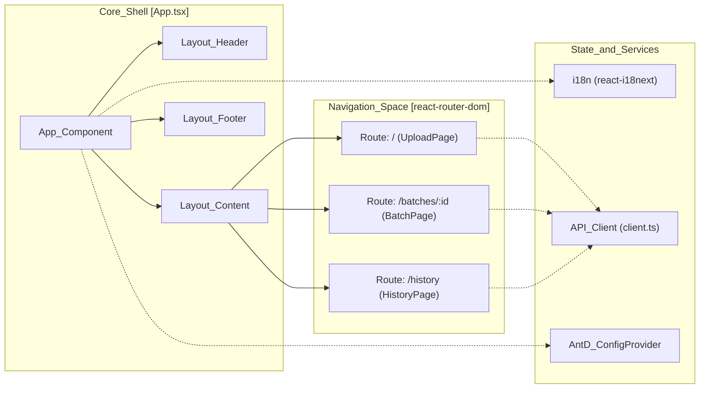

# Frontend Application
Relevant source files
- [web/src/App.tsx](https://github.com/manuxio/batch-dns-checker/blob/ba4e9a28/web/src/App.tsx)
- [web/src/i18n/en.json](https://github.com/manuxio/batch-dns-checker/blob/ba4e9a28/web/src/i18n/en.json)
- [web/src/main.tsx](https://github.com/manuxio/batch-dns-checker/blob/ba4e9a28/web/src/main.tsx)

The **batch-dns-checker** frontend is a Single Page Application (SPA) built with **React**, **TypeScript**, and **Ant Design**. It provides a user-friendly interface for performing single DNS checks, uploading bulk verification files, and monitoring asynchronous batch progress in real-time.

## Architecture Overview

The application follows a standard React architecture using `react-router-dom` for navigation and `react-i18next` for multi-language support. It communicates with the backend via a typed API client.

### Navigation and Routing

The application entry point is `main.tsx`[[web/src/main.tsx:1-15]](), which wraps the `App` component in a `BrowserRouter`. The main `App` component defines the layout and routing structure [[web/src/App.tsx:76-80]]().

| Route | Component | Purpose |
| --- | --- | --- |
| `/` | `UploadPage` | Landing page for single checks and file uploads. |
| `/batches/:id` | `BatchPage` | Real-time monitoring of a specific batch job. |
| `/history` | `HistoryPage` | List of previous batches with management actions. |

### Component Hierarchy and Code Mapping

The following diagram illustrates how the React components and routing map to the logical application structure.

**Frontend Component Map**

Sources: [web/src/App.tsx21-91](https://github.com/manuxio/batch-dns-checker/blob/ba4e9a28/web/src/App.tsx#L21-L91)[web/src/main.tsx9-15](https://github.com/manuxio/batch-dns-checker/blob/ba4e9a28/web/src/main.tsx#L9-L15)

---

## Internationalisation (i18n)

The application supports English (`en`) and Italian (`it`) through `react-i18next`. The `ConfigProvider` from Ant Design is dynamically updated to match the selected language, ensuring that internal UI components (like calendars or empty states) are correctly localized [[web/src/App.tsx:31-37]]().

Translation keys are organized into namespaces within JSON files:

- `nav`: Navigation menu labels.
- `upload`: File upload and single check form text.
- `batch`: Statuses, progress bars, and batch-specific actions.
- `table`: Column headers for DNS results.
- `warning`: Specific DNS warning messages (e.g., "Root servers unreachable").

For details on the setup and adding new languages, see [Internationalisation (i18n)](/manuxio/batch-dns-checker/5.3-internationalisation-(i18n)).

Sources: [web/src/i18n/en.json1-163](https://github.com/manuxio/batch-dns-checker/blob/ba4e9a28/web/src/i18n/en.json#L1-L163)[web/src/App.tsx22-37](https://github.com/manuxio/batch-dns-checker/blob/ba4e9a28/web/src/App.tsx#L22-L37)

---

## API Interaction

The frontend interacts with the backend REST API using a centralized, typed client. This client handles:

- **Batch Lifecycle**: Uploading files, polling for status updates every 1.5 seconds on the `BatchPage`, and requesting cancellations.
- **Data Export**: Triggering CSV/XLSX downloads.
- **Error Handling**: Mapping backend `ApiRequestError` responses to user-friendly messages using the `errors` namespace in the i18n files [[web/src/i18n/en.json:41-49]]().

For details on the client implementation and shared types, see [Shared Components & API Client](/manuxio/batch-dns-checker/5.2-shared-components-and-api-client).

---

## User Interface Pages

The UI is divided into three primary functional areas:

### 1. Upload and Single Check

The `UploadPage` serves as the primary entry point. It features a "Single Check" form for quick verification of a single record and a "Batch Upload" area for CSV/XLSX files [[web/src/i18n/en.json:24-40]]().

### 2. Batch Monitoring

The `BatchPage` provides a high-level summary of a running or completed batch, including a progress bar and a domain-grouped results table. Users can stop running batches or rerun completed ones [[web/src/i18n/en.json:76-95]]().

### 3. History Management

The `HistoryPage` displays a list of the last $N$ batches (defined by backend retention policies). It allows users to jump back into batch details, delete old records, or export results to Excel [[web/src/i18n/en.json:156-162]]().

For details on these pages, see [Pages: Upload, Batch, and History](/manuxio/batch-dns-checker/5.1-pages:-upload-batch-and-history).

**Natural Language to Code Entity Mapping**

| UI Concept | Code Entity / File |
| --- | --- |
| "Language Toggle" | `LanguageSwitcher`[[web/src/App.tsx:14]]() |
| "Result Status Tags" | `StatusTag` component |
| "DNS Results Table" | `ResultsTable` component |
| "Polling Mechanism" | `useEffect` with `setInterval` in `BatchPage` |
| "Dark Mode Theme" | `theme.darkAlgorithm`[[web/src/App.tsx:34]]() |

Sources: [web/src/App.tsx1-91](https://github.com/manuxio/batch-dns-checker/blob/ba4e9a28/web/src/App.tsx#L1-L91)[web/src/i18n/en.json1-163](https://github.com/manuxio/batch-dns-checker/blob/ba4e9a28/web/src/i18n/en.json#L1-L163)