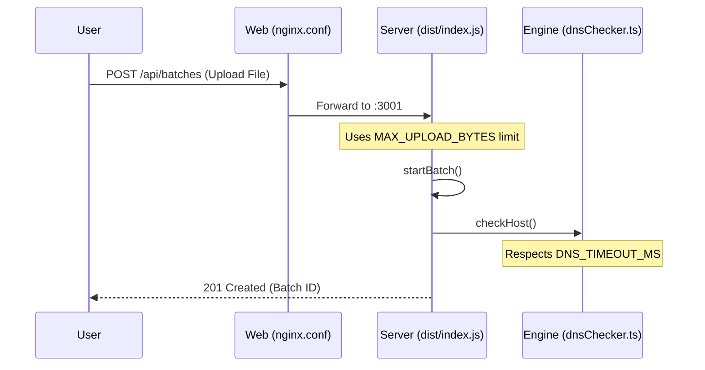

# Getting Started
Relevant source files
- [.env.example](https://github.com/manuxio/batch-dns-checker/blob/ba4e9a28/.env.example)
- [docker-compose.yml](https://github.com/manuxio/batch-dns-checker/blob/ba4e9a28/docker-compose.yml)
- [server/Dockerfile](https://github.com/manuxio/batch-dns-checker/blob/ba4e9a28/server/Dockerfile)
- [web/Dockerfile](https://github.com/manuxio/batch-dns-checker/blob/ba4e9a28/web/Dockerfile)

This page provides a comprehensive guide for setting up and running the CONI SVC DNS Checker. The application is designed to perform large-scale DNS validation using a two-tier architecture: a **Node.js backend** for iterative DNS resolution and a **React frontend** for job management and visualization.

## Prerequisites

Before starting, ensure the following tools are installed on your system:

- **Docker** (Engine version 20.10+)
- **Docker Compose** (V2 recommended)
- **Node.js 20+** (Optional, only required for local development without Docker)

## Installation and Setup

### 1. Clone the Repository

Clone the codebase to your local machine:

```
git clone https://github.com/manuxio/batch-dns-checker.git
cd batch-dns-checker
```

### 2. Environment Configuration

The application uses environment variables to manage networking and DNS engine behavior. Copy the provided template to create your local `.env` file:

```
cp .env.example .env
```

Key variables in `.env` include:

- `WEB_PORT`: The host port where the UI will be accessible (default: `8080`).
- `DNS_FORCE_LOCAL_RESOLVER`: Set to `true` if outbound traffic to arbitrary IPs on port 53 is blocked. This switches the engine from iterative root-server resolution to standard recursive resolution.
- `DNS_HOST_CONCURRENCY`: Controls how many domains are processed in parallel (default: `8`).

**Sources:**

- [.env.example1-27](https://github.com/manuxio/batch-dns-checker/blob/ba4e9a28/.env.example#L1-L27)
- [docker-compose.yml5-17](https://github.com/manuxio/batch-dns-checker/blob/ba4e9a28/docker-compose.yml#L5-L17)

---

## Deployment via Docker Compose

The application is containerized using a multi-stage build process to minimize image size and maximize security. The deployment consists of two services: `server` and `web`.

### Starting the Application

Run the following command from the root directory:

```
docker-compose up -d --build
```

### System Architecture and Data Flow

The following diagram illustrates the interaction between the containers and the host system.

**Deployment Topology & Code Entities**

```

```

**Sources:**

- [docker-compose.yml1-38](https://github.com/manuxio/batch-dns-checker/blob/ba4e9a28/docker-compose.yml#L1-L38)
- [web/Dockerfile1-24](https://github.com/manuxio/batch-dns-checker/blob/ba4e9a28/web/Dockerfile#L1-L24)
- [server/Dockerfile1-45](https://github.com/manuxio/batch-dns-checker/blob/ba4e9a28/server/Dockerfile#L1-L45)

---

## Container Implementation Details

### Server Container (`coni-dns-checker-server`)

The server uses a multi-stage build to compile TypeScript and native dependencies like `better-sqlite3`.

- **Base Image**: `node:20-bookworm-slim` for the runtime to reduce attack surface.
- **Hardening**: The `npm` and `npx` binaries are removed in the final stage to mitigate CVEs associated with package manager dependencies.
- **User**: Runs as the non-root `node` user (UID 1000).
- **Storage**: Mounts a volume at `/data` for the SQLite database.

**Sources:**

- [server/Dockerfile16-27](https://github.com/manuxio/batch-dns-checker/blob/ba4e9a28/server/Dockerfile#L16-L27)
- [server/Dockerfile33-38](https://github.com/manuxio/batch-dns-checker/blob/ba4e9a28/server/Dockerfile#L33-L38)

### Web Container (`coni-dns-checker-web`)

The frontend is served via an unprivileged Nginx instance.

- **Proxying**: Nginx routes all `/api` requests to the `server` container.
- **Security**: Runs as the `nginx` user on port `8080`.
- **Health Checks**: Uses `wget` to verify the availability of the static assets.

**Sources:**

- [web/Dockerfile11-23](https://github.com/manuxio/batch-dns-checker/blob/ba4e9a28/web/Dockerfile#L11-L23)
- [docker-compose.yml24-34](https://github.com/manuxio/batch-dns-checker/blob/ba4e9a28/docker-compose.yml#L24-L34)

---

## Accessing the Application

Once the containers are healthy, you can interact with the system via the following interfaces:

| Interface | URL | Description |
| --- | --- | --- |
| **Web UI** | `http://localhost:8080` | Upload CSV/XLSX files, monitor batches, and export results. |
| **API Health** | `http://localhost:8080/api/health` | Returns `{"status":"ok"}` if the backend and DB are responsive. |
| **Swagger UI** | `http://localhost:8080/api-docs` | Interactive documentation for the REST API. |

### Component Interaction Map

This diagram maps high-level user actions to specific code entry points and environment configurations.

**Action-to-Code Mapping**



**Sources:**

- [docker-compose.yml8-17](https://github.com/manuxio/batch-dns-checker/blob/ba4e9a28/docker-compose.yml#L8-L17)
- [server/Dockerfile41-44](https://github.com/manuxio/batch-dns-checker/blob/ba4e9a28/server/Dockerfile#L41-L44)
- [.env.example1-16](https://github.com/manuxio/batch-dns-checker/blob/ba4e9a28/.env.example#L1-L16)

## Troubleshooting

### Connectivity Issues

If the checker returns "Root Unreachable" or persistent timeouts:

1. Check if your network allows outbound UDP traffic on port 53.
2. If blocked, edit `.env` and set `DNS_FORCE_LOCAL_RESOLVER=true`.
3. Restart with `docker-compose up -d`.

### Permission Errors

The `/data` volume must be writable by the `node` user (UID 1000). The `Dockerfile` handles this during the build, but if using custom bind mounts, ensure the host directory permissions match.

**Sources:**

- [server/Dockerfile36-37](https://github.com/manuxio/batch-dns-checker/blob/ba4e9a28/server/Dockerfile#L36-L37)
- [.env.example18-26](https://github.com/manuxio/batch-dns-checker/blob/ba4e9a28/.env.example#L18-L26)