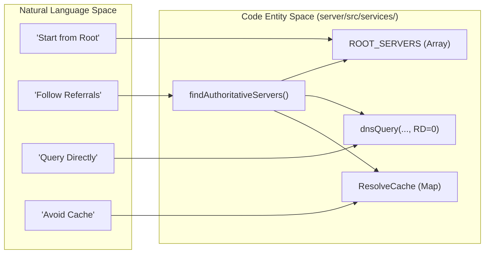

# Glossary
Relevant source files
- [README.md](https://github.com/manuxio/batch-dns-checker/blob/ba4e9a28/README.md?plain=1)
- [server/src/config.ts](https://github.com/manuxio/batch-dns-checker/blob/ba4e9a28/server/src/config.ts)
- [server/src/services/dnsChecker.ts](https://github.com/manuxio/batch-dns-checker/blob/ba4e9a28/server/src/services/dnsChecker.ts)
- [server/src/services/iterativeResolver.ts](https://github.com/manuxio/batch-dns-checker/blob/ba4e9a28/server/src/services/iterativeResolver.ts)
- [server/src/types.ts](https://github.com/manuxio/batch-dns-checker/blob/ba4e9a28/server/src/types.ts)
- [web/src/i18n/en.json](https://github.com/manuxio/batch-dns-checker/blob/ba4e9a28/web/src/i18n/en.json)

This page provides definitions for codebase-specific terms, DNS concepts, and configuration keys used in the CONI SVC DNS Checker. It serves as a technical reference for onboarding engineers to understand the implementation details and data flow of the system.

## 1. Core DNS Concepts

The engine implements a "freshest-possible" resolution strategy by avoiding recursive caches.

| Term | Definition | Implementation Pointer |
| --- | --- | --- |
| **Iterative Resolution** | The process of resolving a domain by walking the delegation chain from Root servers to TLDs, then to Authoritative NS, without using a recursive resolver. | `findAuthoritativeServers`[server/src/services/iterativeResolver.ts136-197](https://github.com/manuxio/batch-dns-checker/blob/ba4e9a28/server/src/services/iterativeResolver.ts#L136-L197) |
| **Authoritative NS** | The nameservers that hold the actual zone file for a domain. The tool identifies these via the **parent delegation** to ensure robustness. | `AuthServer`[server/src/services/iterativeResolver.ts31-34](https://github.com/manuxio/batch-dns-checker/blob/ba4e9a28/server/src/services/iterativeResolver.ts#L31-L34) |
| **RD=0 (Recursion Desired: False)** | A DNS flag used when querying authoritative servers. It instructs the server to only return what it knows locally, preventing it from fetching data elsewhere. | `dnsQuery`[server/src/services/dnsClient.ts4](https://github.com/manuxio/batch-dns-checker/blob/ba4e9a28/server/src/services/dnsClient.ts#L4-L4) |
| **Glue Records** | IP addresses for nameservers provided by the parent zone to prevent circular dependencies (e.g., finding the IP of `ns1.example.com` to resolve `example.com`). | `collectGlue`[server/src/services/iterativeResolver.ts96-107](https://github.com/manuxio/batch-dns-checker/blob/ba4e9a28/server/src/services/iterativeResolver.ts#L96-L107) |
| **Registrable Domain** | The "secondary-level" domain (e.g., `example.it` from `sub.www.example.it`). Used for grouping results in the UI. | `getRegistrableDomain`[server/src/services/dnsChecker.ts2](https://github.com/manuxio/batch-dns-checker/blob/ba4e9a28/server/src/services/dnsChecker.ts#L2-L2) |

### Natural Language to DNS Code Mapping

The following diagram bridges the gap between high-level DNS concepts and the specific functions/classes in the `iterativeResolver.ts` and `dnsClient.ts` files.



**Sources:**[server/src/services/iterativeResolver.ts15-29](https://github.com/manuxio/batch-dns-checker/blob/ba4e9a28/server/src/services/iterativeResolver.ts#L15-L29)[server/src/services/iterativeResolver.ts136-197](https://github.com/manuxio/batch-dns-checker/blob/ba4e9a28/server/src/services/iterativeResolver.ts#L136-L197)[server/src/services/dnsChecker.ts21-30](https://github.com/manuxio/batch-dns-checker/blob/ba4e9a28/server/src/services/dnsChecker.ts#L21-L30)

---

## 2. Policy Record Types

The system supports "Pseudo-types" which are human-friendly aliases for specific TXT records located at standardized subdomains.

| Policy Type | Queried Prefix | Marker (Requirement) |
| --- | --- | --- |
| **SPF** | (root) | `v=spf1` |
| **DKIM** | (as provided) | `v=dkim1` |
| **DMARC** | `_dmarc.` | `v=dmarc1` |
| **MTASTS** | `_mta-sts.` | `v=stsv1` |
| **TLSRPT** | `_smtp._tls.` | `v=tlsrptv1` |
| **BIMI** | `default._bimi.` | `v=bimi1` |

**Sources:**[server/src/services/dnsChecker.ts56-63](https://github.com/manuxio/batch-dns-checker/blob/ba4e9a28/server/src/services/dnsChecker.ts#L56-L63)[server/src/services/dnsChecker.ts75-85](https://github.com/manuxio/batch-dns-checker/blob/ba4e9a28/server/src/services/dnsChecker.ts#L75-L85)

---

## 3. Match Modes & Operators

When a user provides an "Expected Value", the `dnsChecker.ts` service parses it into an `Expectation` object with a specific `MatchMode`.

- **`single`**: A standard "contains" check. The expected value must be present in the results.
- **`all` (AND / `&`)**: Requires **all** listed values to be present.
- **`any` (OR / `|`)**: Requires **at least one** value to be present and **only** allows values from the provided list (closed set).

### Logic Flow for Result Validation

This diagram shows how `checkHost` transforms raw input into a validated status.

```

```

**Sources:**[server/src/services/dnsChecker.ts198-232](https://github.com/manuxio/batch-dns-checker/blob/ba4e9a28/server/src/services/dnsChecker.ts#L198-L232)[server/src/types.ts37](https://github.com/manuxio/batch-dns-checker/blob/ba4e9a28/server/src/types.ts#L37-L37)[server/src/services/dnsChecker.ts28-29](https://github.com/manuxio/batch-dns-checker/blob/ba4e9a28/server/src/services/dnsChecker.ts#L28-L29)

---

## 4. Status Codes

### Batch Status (`BatchStatus`)

Represents the lifecycle of a multi-row check.

- **`pending`**: Initial state before processing.
- **`running`**: Actively querying DNS.
- **`completed`**: All rows processed.
- **`stopped`**: Manually terminated by user via `cancelRequested` flag.
- **`interrupted`**: Set on startup if a batch was left in `running` state (e.g., server crash).
- **`error`**: Fatal failure of the batch runner.

### Host Result Status (`HostResultStatus`)

The aggregated outcome for a single hostname across all its nameservers.

- **`ok`**: All nameservers returned the expected values.
- **`warning`**: Values match, but issues exist (e.g., extra records, inconsistent TTLs, or resolved via fallback).
- **`error`**: Mismatch on one or more nameservers, or no nameservers found.

**Sources:**[server/src/types.ts67](https://github.com/manuxio/batch-dns-checker/blob/ba4e9a28/server/src/types.ts#L67-L67)[server/src/types.ts90-96](https://github.com/manuxio/batch-dns-checker/blob/ba4e9a28/server/src/types.ts#L90-L96)

---

## 5. Configuration Keys (`config.ts`)

These environment variables control the engine's behavior and performance.

| Key | Default | Description |
| --- | --- | --- |
| `DNS_TIMEOUT_MS` | `5000` | Timeout for a single UDP/TCP DNS query. |
| `DNS_HOST_CONCURRENCY` | `8` | Number of hostnames processed in parallel during a batch. |
| `DNS_FORCE_LOCAL_RESOLVER` | `false` | If `true`, bypasses iterative resolution and uses `DNS_FALLBACK_SERVERS`. |
| `SOFT_MAX_RECORDS` | `150` | Threshold for UI warning when uploading large files. |
| `MAX_BATCHES` | `10` | Number of historical batches retained in the SQLite database. |

**Sources:**[server/src/config.ts7-36](https://github.com/manuxio/batch-dns-checker/blob/ba4e9a28/server/src/config.ts#L7-L36)

---

## 6. Internal Data Structures

### `ResolveCache`

A per-batch in-memory cache used by `iterativeResolver.ts`. It specifically caches **discovery** (which servers are authoritative) but never caches **record values**.

- `zoneServers`: Maps a zone name to its `AuthServer[]`. [server/src/services/iterativeResolver.ts47](https://github.com/manuxio/batch-dns-checker/blob/ba4e9a28/server/src/services/iterativeResolver.ts#L47-L47)
- `nsIps`: Maps nameserver hostnames to IP addresses. [server/src/services/iterativeResolver.ts48](https://github.com/manuxio/batch-dns-checker/blob/ba4e9a28/server/src/services/iterativeResolver.ts#L48-L48)

### `NsAnswer`

The raw result from a single specific nameserver.

- `status`: One of `ok`, `mismatch`, `error`, or `timeout`. [server/src/types.ts53](https://github.com/manuxio/batch-dns-checker/blob/ba4e9a28/server/src/types.ts#L53-L53)
- `returnedValues`: The actual normalized strings returned by the wire. [server/src/types.ts61](https://github.com/manuxio/batch-dns-checker/blob/ba4e9a28/server/src/types.ts#L61-L61)

**Sources:**[server/src/services/iterativeResolver.ts46-51](https://github.com/manuxio/batch-dns-checker/blob/ba4e9a28/server/src/services/iterativeResolver.ts#L46-L51)[server/src/types.ts56-65](https://github.com/manuxio/batch-dns-checker/blob/ba4e9a28/server/src/types.ts#L56-L65)