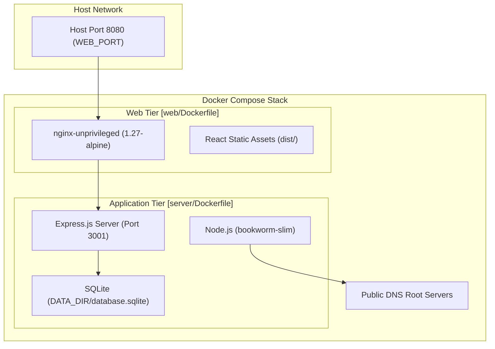
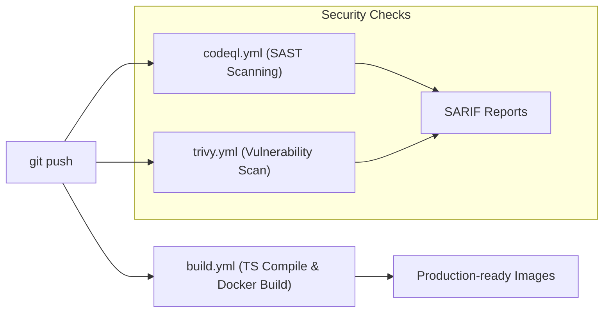

# Infrastructure & Deployment
Relevant source files
- [docker-compose.yml](https://github.com/manuxio/batch-dns-checker/blob/ba4e9a28/docker-compose.yml)
- [server/Dockerfile](https://github.com/manuxio/batch-dns-checker/blob/ba4e9a28/server/Dockerfile)
- [web/Dockerfile](https://github.com/manuxio/batch-dns-checker/blob/ba4e9a28/web/Dockerfile)

The **CONI SVC DNS Checker** is deployed as a containerised application using a two-tier architecture. The deployment topology consists of a Node.js backend (the "server") and an Nginx-based frontend (the "web" container) that serves the React SPA and acts as a reverse proxy.

### Deployment Topology

The system is orchestrated via `docker-compose.yml`, which defines the networking and lifecycle of the two primary services. The `web` container serves as the single entry point for users, while the `server` container is isolated from the host network, communicating only with the `web` tier.

#### Code-to-Infrastructure Mapping

The following diagram illustrates how the codebase entities map to the deployed infrastructure components.

**System Architecture Diagram**

Sources: [docker-compose.yml1-38](https://github.com/manuxio/batch-dns-checker/blob/ba4e9a28/docker-compose.yml#L1-L38)[server/Dockerfile16-44](https://github.com/manuxio/batch-dns-checker/blob/ba4e9a28/server/Dockerfile#L16-L44)[web/Dockerfile13-23](https://github.com/manuxio/batch-dns-checker/blob/ba4e9a28/web/Dockerfile#L13-L23)

---

### Service Definitions

The infrastructure is split into two specialized containers to separate the concerns of static asset delivery and heavy computational DNS processing.

| Service | Role | Key Technologies | Persistence |
| --- | --- | --- | --- |
| **Server** | API, DNS Engine, Batch Processing | Node.js 20, Express, Better-SQLite3 | `/data` volume |
| **Web** | Static Hosting, Reverse Proxy | Nginx Unprivileged, Vite, React | Stateless |

#### Server Container

The `server` container runs the core business logic. It is built using a multi-stage process that compiles TypeScript and native dependencies (like `better-sqlite3`) in a `bookworm` environment before transferring artifacts to a `bookworm-slim` runtime. For security, `npm` and `npx` are stripped from the final image to reduce the attack surface.

For details on hardening and the health-check mechanism, see **[Server Container (#6.1)](https://github.com/manuxio/batch-dns-checker/blob/ba4e9a28/Server Container (#6.1))**.

Sources: [server/Dockerfile1-45](https://github.com/manuxio/batch-dns-checker/blob/ba4e9a28/server/Dockerfile#L1-L45)[docker-compose.yml2-22](https://github.com/manuxio/batch-dns-checker/blob/ba4e9a28/docker-compose.yml#L2-L22)

#### Web Container & Nginx Configuration

The `web` container serves the React frontend and handles routing. It uses the `nginxinc/nginx-unprivileged` image to ensure the process runs without root privileges. Nginx is configured to proxy all `/api` requests to the `server` container while serving the SPA with appropriate cache headers and a fallback mechanism for client-side routing.

For details on the reverse proxy timeouts and CSP headers, see **[Web Container & Nginx Configuration (#6.2)](https://github.com/manuxio/batch-dns-checker/blob/ba4e9a28/Web Container & Nginx Configuration (#6.2))**.

Sources: [web/Dockerfile1-24](https://github.com/manuxio/batch-dns-checker/blob/ba4e9a28/web/Dockerfile#L1-L24)[docker-compose.yml24-34](https://github.com/manuxio/batch-dns-checker/blob/ba4e9a28/docker-compose.yml#L24-L34)

---

### CI/CD & Security Lifecycle

The project utilizes GitHub Actions for continuous integration, focusing on three pillars: build validation, static analysis, and vulnerability scanning.

**Pipeline Flow Diagram**

#### Pipelines Overview

- **Build Workflow**: Validates that both the server and web components compile correctly and that `npm audit` passes.
- **CodeQL**: Performs Static Application Security Testing (SAST) using the `security-and-quality` query suite.
- **Trivy**: Scans the filesystem and container layers for known vulnerabilities, hardcoded secrets, and infrastructure misconfigurations.

For details on the CI/CD configuration, see **[CI/CD Pipelines & Security Scanning (#6.3)](https://github.com/manuxio/batch-dns-checker/blob/ba4e9a28/CI/CD Pipelines & Security Scanning (#6.3))**.

Sources: [server/Dockerfile20-27](https://github.com/manuxio/batch-dns-checker/blob/ba4e9a28/server/Dockerfile#L20-L27)[web/Dockerfile15-16](https://github.com/manuxio/batch-dns-checker/blob/ba4e9a28/web/Dockerfile#L15-L16)