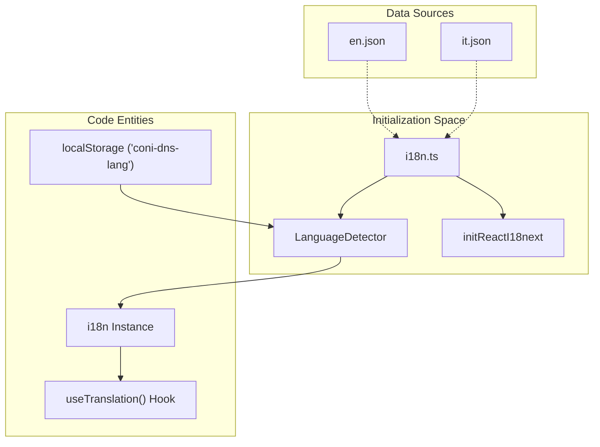
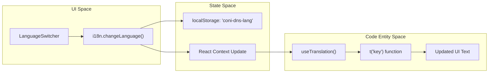

# Internationalisation (i18n)
Relevant source files
- [web/src/components/LanguageSwitcher.tsx](https://github.com/manuxio/batch-dns-checker/blob/ba4e9a28/web/src/components/LanguageSwitcher.tsx)
- [web/src/i18n/en.json](https://github.com/manuxio/batch-dns-checker/blob/ba4e9a28/web/src/i18n/en.json)
- [web/src/i18n/index.ts](https://github.com/manuxio/batch-dns-checker/blob/ba4e9a28/web/src/i18n/index.ts)
- [web/src/i18n/it.json](https://github.com/manuxio/batch-dns-checker/blob/ba4e9a28/web/src/i18n/it.json)

The CONI SVC DNS Checker frontend is built with multi-language support, primarily targeting Italian and English. The system uses `react-i18next` for state management and translation injection, ensuring that all UI strings, error messages, and DNS-specific status descriptions are localised.

## i18n Configuration

The internationalisation engine is initialised in `web/src/i18n/index.ts`. It leverages `i18next-browser-languagedetector` to persist the user's preference in the browser's `localStorage` under the key `coni-dns-lang`[web/src/i18n/index.ts22](https://github.com/manuxio/batch-dns-checker/blob/ba4e9a28/web/src/i18n/index.ts#L22-L22)

### Technical Setup

- **Library**: `i18next` with `initReactI18next`[web/src/i18n/index.ts1-2](https://github.com/manuxio/batch-dns-checker/blob/ba4e9a28/web/src/i18n/index.ts#L1-L2)
- **Default Language**: Italian (`it`) is configured as the `fallbackLng`[web/src/i18n/index.ts17](https://github.com/manuxio/batch-dns-checker/blob/ba4e9a28/web/src/i18n/index.ts#L17-L17)
- **Persistence**: Choices are cached in `localStorage`[web/src/i18n/index.ts21](https://github.com/manuxio/batch-dns-checker/blob/ba4e9a28/web/src/i18n/index.ts#L21-L21)
- **Resources**: Translation strings are imported from static JSON files [web/src/i18n/index.ts4-5](https://github.com/manuxio/batch-dns-checker/blob/ba4e9a28/web/src/i18n/index.ts#L4-L5)

**i18n Initialisation Flow**

Sources: [web/src/i18n/index.ts1-25](https://github.com/manuxio/batch-dns-checker/blob/ba4e9a28/web/src/i18n/index.ts#L1-L25)

## Translation Files

The project maintains two main translation files: `web/src/i18n/en.json` and `web/src/i18n/it.json`. These files share an identical key structure to ensure consistency across locales.

### Key Namespaces

| Namespace | Purpose | Key Examples |
| --- | --- | --- |
| `nav` | Sidebar and navigation links | `newCheck`, `history`, `apiDocs` |
| `upload` | File upload zone and batch creation | `dropText`, `batchName`, `softLimitNote` |
| `batch` | Batch details and execution controls | `progress`, `stop`, `rerun`, `groupedByDomain` |
| `table` | DNS result table headers and cells | `hostname`, `expected`, `nameservers`, `nsIp` |
| `rules` | Documentation on verification logic | `authoritative`, `contains`, `cname`, `policy` |
| `warning` | DNS-specific warnings from the engine | `someNameserversUnreachable`, `extraRecordsPresent` |
| `message` | Informational messages or soft errors | `noAuthoritativeNameservers`, `nsIpResolutionFailed` |
| `matchMode` | Logic operators for verification | `single`, `all (AND)`, `one of (OR)` |
| `invalid` | Row-level validation errors from the parser | `emptyHostname`, `unsupportedType`, `mixedOperators` |
| `errors` | API and application-level failures | `parseFailed`, `batchNotFound`, `fileTooLarge` |

Sources: [web/src/i18n/en.json1-163](https://github.com/manuxio/batch-dns-checker/blob/ba4e9a28/web/src/i18n/en.json#L1-L163)[web/src/i18n/it.json1-163](https://github.com/manuxio/batch-dns-checker/blob/ba4e9a28/web/src/i18n/it.json#L1-L163)

## LanguageSwitcher Component

The `LanguageSwitcher` component provides a toggle for the user to switch between English and Italian. It is implemented using the Ant Design `Segmented` component.

- **Detection**: It checks `i18n.language` to determine the current state, defaulting to 'it' if the prefix is not 'en' [web/src/components/LanguageSwitcher.tsx7](https://github.com/manuxio/batch-dns-checker/blob/ba4e9a28/web/src/components/LanguageSwitcher.tsx#L7-L7)
- **Action**: When changed, it calls `i18n.changeLanguage()` which triggers a re-render of all components using the `useTranslation` hook [web/src/components/LanguageSwitcher.tsx12](https://github.com/manuxio/batch-dns-checker/blob/ba4e9a28/web/src/components/LanguageSwitcher.tsx#L12-L12)

**Language Toggle Logic**

Sources: [web/src/components/LanguageSwitcher.tsx5-19](https://github.com/manuxio/batch-dns-checker/blob/ba4e9a28/web/src/components/LanguageSwitcher.tsx#L5-L19)

## Interpolation and Plurals

The translation system supports dynamic values and basic pluralisation through interpolation.

- **Interpolation**: Used for dynamic limits or counts, such as the soft limit warning: `{{count}} records per batch`[web/src/i18n/en.json36](https://github.com/manuxio/batch-dns-checker/blob/ba4e9a28/web/src/i18n/en.json#L36-L36)
- **Dynamic Messages**: Used in the history section to show retention policies: `The last {{count}} batches are retained`[web/src/i18n/en.json159](https://github.com/manuxio/batch-dns-checker/blob/ba4e9a28/web/src/i18n/en.json#L159-L159)

Sources: [web/src/i18n/en.json36-39](https://github.com/manuxio/batch-dns-checker/blob/ba4e9a28/web/src/i18n/en.json#L36-L39)[web/src/i18n/en.json159](https://github.com/manuxio/batch-dns-checker/blob/ba4e9a28/web/src/i18n/en.json#L159-L159)