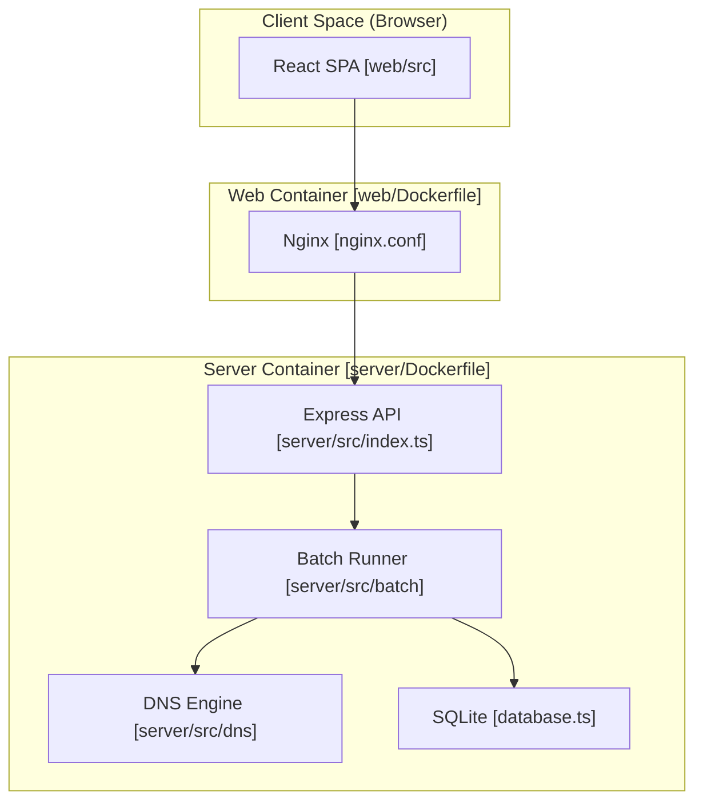
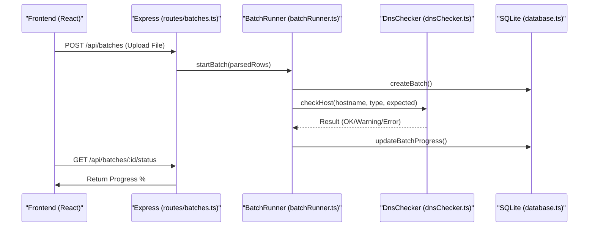

# Overview
Relevant source files
- [.env.example](https://github.com/manuxio/batch-dns-checker/blob/ba4e9a28/.env.example)
- [README.md](https://github.com/manuxio/batch-dns-checker/blob/ba4e9a28/README.md?plain=1)
- [docker-compose.yml](https://github.com/manuxio/batch-dns-checker/blob/ba4e9a28/docker-compose.yml)

The **CONI SVC DNS Checker** is a specialized tool designed to verify DNS compliance for third-party domains. Unlike standard DNS tools that rely on recursive resolvers (which may return cached or stale data), this application performs **iterative resolution starting from the root servers** to query every authoritative nameserver directly. This ensures that the results reflect the freshest possible state of the DNS infrastructure.

The system allows users to upload batches of hostnames and expected values via CSV or Excel files, processes them asynchronously, and provides a detailed report on whether the actual DNS records match the expectations across all authoritative sources.

## Core Rationale: Authoritative Verification

The engine is built on three architectural principles:

1. **Root-First Iteration**: Every resolution walks the delegation chain from the root servers to the TLD, and finally to the domain's authoritative nameservers [README.md56-65](https://github.com/manuxio/batch-dns-checker/blob/ba4e9a28/README.md?plain=1#L56-L65)
2. **Direct NS Querying**: Once identified, every authoritative nameserver is queried individually with recursion disabled (`RD=0`) [README.md78-84](https://github.com/manuxio/batch-dns-checker/blob/ba4e9a28/README.md?plain=1#L78-L84)
3. **Consistency Enforcement**: A record is only marked as `OK` if **all** authoritative nameservers return the expected value. Any discrepancy is flagged as an error [README.md80-84](https://github.com/manuxio/batch-dns-checker/blob/ba4e9a28/README.md?plain=1#L80-L84)

## System Architecture

The application uses a two-tier architecture containerized with Docker, consisting of a React-based frontend and a Node.js/TypeScript backend.

### High-Level Component Map

This diagram maps the logical system components to their respective code entities and physical containers.

**Sources:**[README.md129-155](https://github.com/manuxio/batch-dns-checker/blob/ba4e9a28/README.md?plain=1#L129-L155)[docker-compose.yml1-35](https://github.com/manuxio/batch-dns-checker/blob/ba4e9a28/docker-compose.yml#L1-L35)[web/nginx.conf1-20](https://github.com/manuxio/batch-dns-checker/blob/ba4e9a28/web/nginx.conf#L1-L20)

## Two-Tier Architecture

### Backend (Node.js & Express)

The backend is responsible for the heavy lifting: parsing files, managing the SQLite-backed job queue, and executing the DNS resolution logic.

- **DNS Engine**: Located in `server/src/dns`, it handles the complex logic of iterative resolution and compliance checking [README.md144-145](https://github.com/manuxio/batch-dns-checker/blob/ba4e9a28/README.md?plain=1#L144-L145)
- **Batch Management**: Processes uploaded files (`.csv`, `.xlsx`) and runs them as background tasks using a concurrency-limited worker pool [README.md118-120](https://github.com/manuxio/batch-dns-checker/blob/ba4e9a28/README.md?plain=1#L118-L120)
- **Persistence**: Uses SQLite to store the last 10 batches, allowing for history retrieval and re-runs [README.md118-119](https://github.com/manuxio/batch-dns-checker/blob/ba4e9a28/README.md?plain=1#L118-L119)

### Frontend (React & Ant Design)

The frontend is a Single Page Application (SPA) built with Vite and Ant Design.

- **Internationalization**: Supports English and Italian [README.md24-25](https://github.com/manuxio/batch-dns-checker/blob/ba4e9a28/README.md?plain=1#L24-L25)
- **Real-time Monitoring**: Polls the backend to show live progress of active batches [README.md118-119](https://github.com/manuxio/batch-dns-checker/blob/ba4e9a28/README.md?plain=1#L118-L119)
- **Result Visualization**: Groups results by secondary-level domain (SLD) and provides detailed per-nameserver breakdowns [README.md19-22](https://github.com/manuxio/batch-dns-checker/blob/ba4e9a28/README.md?plain=1#L19-L22)

## Navigation

To explore the technical details of the CONI SVC DNS Checker, follow these guides:

| Page | Description |
| --- | --- |
| **[Getting Started](/manuxio/batch-dns-checker/1.1-getting-started)** | Step-by-step instructions for local setup and production deployment using Docker. |
| **[Configuration Reference](/manuxio/batch-dns-checker/1.2-configuration-reference)** | Comprehensive list of environment variables for tuning DNS timeouts, concurrency, and limits. |

### Technical Space Bridge

The following diagram illustrates how the API routes interact with the underlying service layers.

**Sources:**[README.md140-146](https://github.com/manuxio/batch-dns-checker/blob/ba4e9a28/README.md?plain=1#L140-L146)[server/src/batch/batchRunner.ts1-50](https://github.com/manuxio/batch-dns-checker/blob/ba4e9a28/server/src/batch/batchRunner.ts#L1-L50)[server/src/dns/dnsChecker.ts1-30](https://github.com/manuxio/batch-dns-checker/blob/ba4e9a28/server/src/dns/dnsChecker.ts#L1-L30)