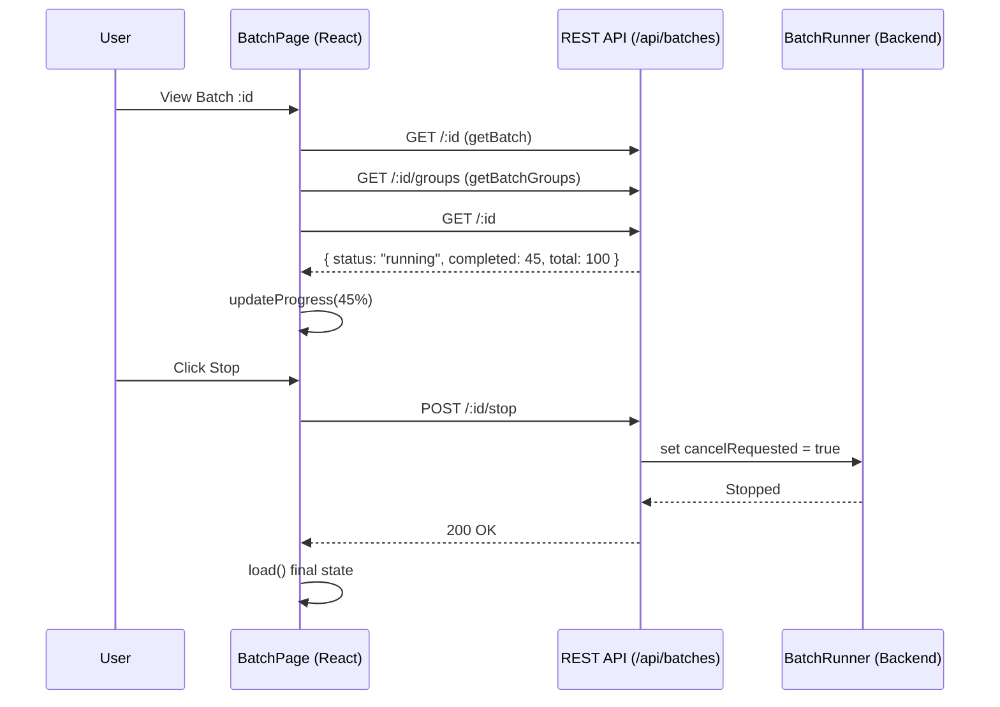
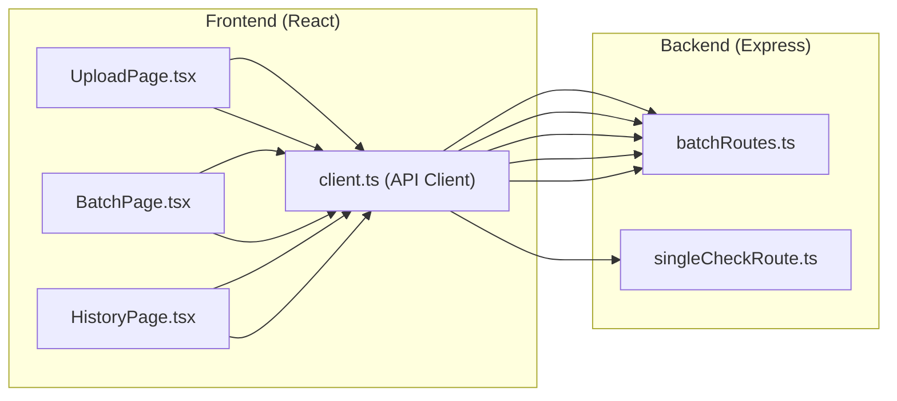

# Pages: Upload, Batch, and History
Relevant source files
- [web/src/pages/BatchPage.tsx](https://github.com/manuxio/batch-dns-checker/blob/ba4e9a28/web/src/pages/BatchPage.tsx)
- [web/src/pages/HistoryPage.tsx](https://github.com/manuxio/batch-dns-checker/blob/ba4e9a28/web/src/pages/HistoryPage.tsx)
- [web/src/pages/UploadPage.tsx](https://github.com/manuxio/batch-dns-checker/blob/ba4e9a28/web/src/pages/UploadPage.tsx)

This page describes the primary user interface components of the CONI SVC DNS Checker. The frontend is built as a React Single Page Application (SPA) using Ant Design components. It provides three main views to handle single DNS checks, bulk file uploads, real-time progress monitoring, and historical data management.

## 1. UploadPage

The `UploadPage` serves as the entry point for both synchronous single-record validation and asynchronous batch processing. It also provides the necessary documentation and templates for users to format their input files correctly.

### 1.1 Single-Check Interface

Users can perform a real-time check for a specific hostname, record type, and expected value. This calls the synchronous `checkSingle` API [web/src/pages/UploadPage.tsx131-135](https://github.com/manuxio/batch-dns-checker/blob/ba4e9a28/web/src/pages/UploadPage.tsx#L131-L135) The results are displayed immediately using the `ResultsTable` component [web/src/pages/UploadPage.tsx197](https://github.com/manuxio/batch-dns-checker/blob/ba4e9a28/web/src/pages/UploadPage.tsx#L197-L197)

### 1.2 Batch Upload & Validation Rules

The page includes a `RulesCard` that enumerates the logic used by the `dnsChecker` (e.g., authoritative NS requirements, CNAME following, and match operators) [web/src/pages/UploadPage.tsx89-109](https://github.com/manuxio/batch-dns-checker/blob/ba4e9a28/web/src/pages/UploadPage.tsx#L89-L109)
The `UploadForm` uses the Ant Design `Dragger` component to accept `.csv` and `.xlsx` files [web/src/pages/UploadPage.tsx247-255](https://github.com/manuxio/batch-dns-checker/blob/ba4e9a28/web/src/pages/UploadPage.tsx#L247-L255) Upon submission, it calls `createBatch`[web/src/pages/UploadPage.tsx226](https://github.com/manuxio/batch-dns-checker/blob/ba4e9a28/web/src/pages/UploadPage.tsx#L226-L226) which returns a `Batch` object. If the file exceeds the `softMaxRecords` configuration, a warning is displayed [web/src/pages/UploadPage.tsx227-232](https://github.com/manuxio/batch-dns-checker/blob/ba4e9a28/web/src/pages/UploadPage.tsx#L227-L232)

### 1.3 Templates

To ensure compatibility with the `fileParser`, the page provides download links for pre-formatted CSV and Excel templates via the `templateUrl` helper [web/src/pages/UploadPage.tsx311-326](https://github.com/manuxio/batch-dns-checker/blob/ba4e9a28/web/src/pages/UploadPage.tsx#L311-L326)

**Sources:**

- [web/src/pages/UploadPage.tsx50-87](https://github.com/manuxio/batch-dns-checker/blob/ba4e9a28/web/src/pages/UploadPage.tsx#L50-L87) (Main component structure)
- [web/src/pages/UploadPage.tsx111-202](https://github.com/manuxio/batch-dns-checker/blob/ba4e9a28/web/src/pages/UploadPage.tsx#L111-L202) (SingleCheckCard implementation)
- [web/src/pages/UploadPage.tsx204-301](https://github.com/manuxio/batch-dns-checker/blob/ba4e9a28/web/src/pages/UploadPage.tsx#L204-L301) (UploadForm logic)

---

## 2. BatchPage

The `BatchPage` provides a detailed view of a specific batch's progress and results. It is designed to handle large datasets by grouping results by domain.

### 2.1 Progress Polling

When a batch is in a `pending` or `running` state [web/src/pages/BatchPage.tsx38](https://github.com/manuxio/batch-dns-checker/blob/ba4e9a28/web/src/pages/BatchPage.tsx#L38-L38) the page initiates a polling mechanism using `setTimeout`. It refreshes the batch data and grouped results every **1.5 seconds**[web/src/pages/BatchPage.tsx71-85](https://github.com/manuxio/batch-dns-checker/blob/ba4e9a28/web/src/pages/BatchPage.tsx#L71-L85)

### 2.2 Result Aggregation

Results are displayed in two primary ways:

1. **Invalid Rows**: Rows that failed parsing (e.g., unsupported record types or empty hostnames) are shown in an `InvalidRowsTable`[web/src/pages/BatchPage.tsx221-231](https://github.com/manuxio/batch-dns-checker/blob/ba4e9a28/web/src/pages/BatchPage.tsx#L221-L231)
2. **Grouped Results**: Valid records are retrieved via `getBatchGroups`[web/src/pages/BatchPage.tsx56](https://github.com/manuxio/batch-dns-checker/blob/ba4e9a28/web/src/pages/BatchPage.tsx#L56-L56) and rendered using the `ResultsTable` component, which supports expanding rows to see per-NameServer details.

### 2.3 Batch Actions

The page provides several control actions:

- **Stop**: Sends a request to `stopBatch(id)` to halt processing [web/src/pages/BatchPage.tsx87-99](https://github.com/manuxio/batch-dns-checker/blob/ba4e9a28/web/src/pages/BatchPage.tsx#L87-L99)
- **Rerun**: Calls `rerunBatch(id)`, which creates a new batch with the same input, and navigates the user to the new ID [web/src/pages/BatchPage.tsx101-110](https://github.com/manuxio/batch-dns-checker/blob/ba4e9a28/web/src/pages/BatchPage.tsx#L101-L110)
- **Export**: Provides direct links to the `exportUrl` for XLSX and CSV formats, which are disabled while the batch is running [web/src/pages/BatchPage.tsx166-179](https://github.com/manuxio/batch-dns-checker/blob/ba4e9a28/web/src/pages/BatchPage.tsx#L166-L179)

### Data Flow: Batch Monitoring

The following diagram illustrates how the `BatchPage` interacts with the backend during the lifecycle of a batch.

**Batch Lifecycle and UI Interaction**

**Sources:**

- [web/src/pages/BatchPage.tsx40-111](https://github.com/manuxio/batch-dns-checker/blob/ba4e9a28/web/src/pages/BatchPage.tsx#L40-L111) (State management and polling)
- [web/src/pages/BatchPage.tsx154-187](https://github.com/manuxio/batch-dns-checker/blob/ba4e9a28/web/src/pages/BatchPage.tsx#L154-L187) (Action buttons implementation)

---

## 3. HistoryPage

The `HistoryPage` provides a management interface for all batches stored in the system.

### 3.1 Batch List

It fetches a summary list of all batches via `listBatches()`[web/src/pages/HistoryPage.tsx46](https://github.com/manuxio/batch-dns-checker/blob/ba4e9a28/web/src/pages/HistoryPage.tsx#L46-L46) The table displays the batch name (or filename), creation date (localized to the user's browser locale), status, and a `CountsSummary` showing the distribution of OK/Warning/Error results [web/src/pages/HistoryPage.tsx85-119](https://github.com/manuxio/batch-dns-checker/blob/ba4e9a28/web/src/pages/HistoryPage.tsx#L85-L119)

### 3.2 Retention Awareness

The page displays an information alert showing the `maxBatches` configuration [web/src/pages/HistoryPage.tsx164-168](https://github.com/manuxio/batch-dns-checker/blob/ba4e9a28/web/src/pages/HistoryPage.tsx#L164-L168) This informs the user that older batches may be automatically pruned by the backend `pruneOldBatches` logic.

### 3.3 Management Actions

- **Navigation**: Clicking the batch name navigates to the `BatchPage`[web/src/pages/HistoryPage.tsx89-93](https://github.com/manuxio/batch-dns-checker/blob/ba4e9a28/web/src/pages/HistoryPage.tsx#L89-L93)
- **Deletion**: Users can permanently remove a batch via `deleteBatch(id)`[web/src/pages/HistoryPage.tsx63-72](https://github.com/manuxio/batch-dns-checker/blob/ba4e9a28/web/src/pages/HistoryPage.tsx#L63-L72)
- **Rerun**: Allows restarting a historical check without re-uploading the file [web/src/pages/HistoryPage.tsx74-83](https://github.com/manuxio/batch-dns-checker/blob/ba4e9a28/web/src/pages/HistoryPage.tsx#L74-L83)

**Sources:**

- [web/src/pages/HistoryPage.tsx34-61](https://github.com/manuxio/batch-dns-checker/blob/ba4e9a28/web/src/pages/HistoryPage.tsx#L34-L61) (Initialization and config loading)
- [web/src/pages/HistoryPage.tsx85-152](https://github.com/manuxio/batch-dns-checker/blob/ba4e9a28/web/src/pages/HistoryPage.tsx#L85-L152) (Table column definitions)

---

## 4. Code Entity Mapping

The following diagram maps the UI components to their respective API client functions and backend route handlers.

**UI to Backend Mapping**

**Sources:**

- [web/src/api/client.ts1-150](https://github.com/manuxio/batch-dns-checker/blob/ba4e9a28/web/src/api/client.ts#L1-L150) (Client implementation)
- [web/src/pages/UploadPage.tsx26-32](https://github.com/manuxio/batch-dns-checker/blob/ba4e9a28/web/src/pages/UploadPage.tsx#L26-L32) (UploadPage imports)
- [web/src/pages/BatchPage.tsx26-32](https://github.com/manuxio/batch-dns-checker/blob/ba4e9a28/web/src/pages/BatchPage.tsx#L26-L32) (BatchPage imports)
- [web/src/pages/HistoryPage.tsx23-29](https://github.com/manuxio/batch-dns-checker/blob/ba4e9a28/web/src/pages/HistoryPage.tsx#L23-L29) (HistoryPage imports)