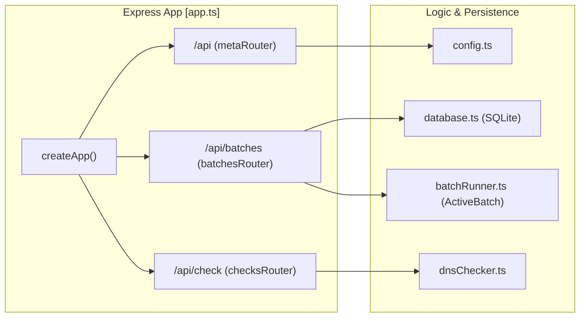

# REST API
Relevant source files
- [server/src/app.ts](https://github.com/manuxio/batch-dns-checker/blob/ba4e9a28/server/src/app.ts)
- [server/src/index.ts](https://github.com/manuxio/batch-dns-checker/blob/ba4e9a28/server/src/index.ts)
- [server/src/openapi.ts](https://github.com/manuxio/batch-dns-checker/blob/ba4e9a28/server/src/openapi.ts)

The CONI SVC DNS Checker provides a comprehensive REST API built with Express.js [server/src/app.ts1-12](https://github.com/manuxio/batch-dns-checker/blob/ba4e9a28/server/src/app.ts#L1-L12) The API facilitates both synchronous single-record verification and asynchronous batch processing of DNS compliance checks.

The server exposes a machine-readable OpenAPI 3.0 specification at `/api/openapi.json` and an interactive Swagger UI for testing at `/api/docs`[server/src/app.ts18-25](https://github.com/manuxio/batch-dns-checker/blob/ba4e9a28/server/src/app.ts#L18-L25)

### API Architecture

The API surface is organized into three distinct route groups mounted under the `/api` prefix [server/src/app.ts28-30](https://github.com/manuxio/batch-dns-checker/blob/ba4e9a28/server/src/app.ts#L28-L30)

| Group | Base Path | Responsibility |
| --- | --- | --- |
| **Meta** | `/api` | Health checks, system configuration, and record type discovery. |
| **Batches** | `/api/batches` | Lifecycle management for asynchronous file-based processing. |
| **Checks** | `/api/check` | Synchronous endpoint for individual hostname verification. |

#### Code Entity Mapping

The following diagram illustrates how the Express application maps incoming requests to specific router modules and their underlying data sources.

**API Route Distribution**



Sources: [server/src/app.ts11-31](https://github.com/manuxio/batch-dns-checker/blob/ba4e9a28/server/src/app.ts#L11-L31)[server/src/openapi.ts19-23](https://github.com/manuxio/batch-dns-checker/blob/ba4e9a28/server/src/openapi.ts#L19-L23)

---

### Batch Endpoints

The Batch API handles the heavy lifting of the system, allowing users to upload CSV or XLSX files containing hundreds of records for verification. Because DNS resolution across multiple authoritative nameservers is time-consuming, these operations are handled asynchronously.

Key capabilities include:

- **File Ingestion**: Uploading files via `multipart/form-data` to trigger new processing jobs [server/src/openapi.ts111-135](https://github.com/manuxio/batch-dns-checker/blob/ba4e9a28/server/src/openapi.ts#L111-L135)
- **Status Monitoring**: Polling for progress percentages and record counts [server/src/openapi.ts183-199](https://github.com/manuxio/batch-dns-checker/blob/ba4e9a28/server/src/openapi.ts#L183-L199)
- **Result Aggregation**: Retrieving results grouped by secondary-level domain (SLD) [server/src/openapi.ts201-226](https://github.com/manuxio/batch-dns-checker/blob/ba4e9a28/server/src/openapi.ts#L201-L226)
- **Lifecycle Control**: Stopping active batches, rerunning existing ones, or deleting history [server/src/openapi.ts173-181](https://github.com/manuxio/batch-dns-checker/blob/ba4e9a28/server/src/openapi.ts#L173-L181)

For a full reference of request/response schemas and polling logic, see **[Batch Endpoints](/manuxio/batch-dns-checker/4.1-batch-endpoints)**.

Sources: [server/src/openapi.ts88-231](https://github.com/manuxio/batch-dns-checker/blob/ba4e9a28/server/src/openapi.ts#L88-L231)

---

### Single-Check & Meta Endpoints

While the batch system is designed for bulk processing, the API also provides synchronous endpoints for immediate feedback and system discovery.

- **Synchronous Verification**: The `/api/check` endpoint allows for real-time validation of a single hostname against a specific record type and expected value. This is used by the UI's "Single Check" form.
- **System Discovery**: Endpoints like `/api/record-types` return the list of DNS types supported by the internal engine (e.g., `A`, `AAAA`, `MX`, `SPF`, `DKIM`, etc.) [server/src/openapi.ts41-64](https://github.com/manuxio/batch-dns-checker/blob/ba4e9a28/server/src/openapi.ts#L41-L64)
- **Templates**: Provides dynamically generated CSV/XLSX templates to ensure users upload files with correct headers [server/src/openapi.ts65-87](https://github.com/manuxio/batch-dns-checker/blob/ba4e9a28/server/src/openapi.ts#L65-L87)

For details on validation rules and response shapes for these routes, see **[Single-Check & Meta Endpoints](/manuxio/batch-dns-checker/4.2-single-check-and-meta-endpoints)**.

Sources: [server/src/openapi.ts24-87](https://github.com/manuxio/batch-dns-checker/blob/ba4e9a28/server/src/openapi.ts#L24-L87)[server/src/app.ts30](https://github.com/manuxio/batch-dns-checker/blob/ba4e9a28/server/src/app.ts#L30-L30)

---

### Global Error Handling

The API implements a centralized error handling middleware that standardizes error responses. It specifically handles file upload constraints (e.g., `LIMIT_FILE_SIZE`) and maps them to localized error keys used by the frontend [server/src/app.ts38-50](https://github.com/manuxio/batch-dns-checker/blob/ba4e9a28/server/src/app.ts#L38-L50)

**Standard Error Shape**

```
{
  "error": "string (error_key)",
  "details": {
    "optional": "metadata"
  }
}
```

**Common Status Codes**

- `400 Bad Request`: Validation failure or invalid file format.
- `404 Not Found`: Batch ID does not exist [server/src/app.ts33-35](https://github.com/manuxio/batch-dns-checker/blob/ba4e9a28/server/src/app.ts#L33-L35)
- `413 Payload Too Large`: Uploaded file exceeds `config.maxUploadBytes`.
- `500 Internal Server Error`: Unhandled backend exceptions.

Sources: [server/src/app.ts33-50](https://github.com/manuxio/batch-dns-checker/blob/ba4e9a28/server/src/app.ts#L33-L50)