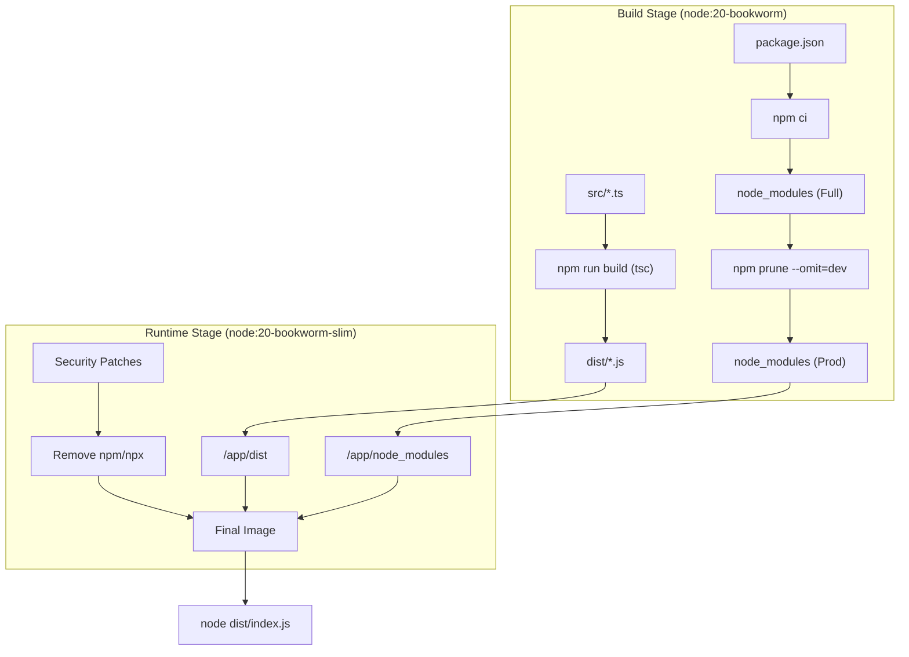
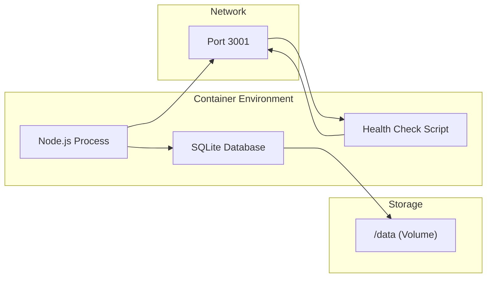

# Server Container
Relevant source files
- [server/Dockerfile](https://github.com/manuxio/batch-dns-checker/blob/ba4e9a28/server/Dockerfile)
- [server/package.json](https://github.com/manuxio/batch-dns-checker/blob/ba4e9a28/server/package.json)
- [server/tsconfig.json](https://github.com/manuxio/batch-dns-checker/blob/ba4e9a28/server/tsconfig.json)

The **Server Container** provides the execution environment for the Node.js backend API. It is designed with a focus on security hardening, minimal attack surface, and persistence for the SQLite database. The container encapsulates the DNS resolution engine, the batch processing logic, and the Express REST API.

## Build Pipeline

The container utilizes a multi-stage Dockerfile to separate the build-time environment from the production runtime. This ensures that compilers, build tools, and development dependencies are not present in the final image.

### Stage 1: Build

The `build` stage uses the `node:20-bookworm` image to compile the TypeScript source code into JavaScript [server/Dockerfile2-3](https://github.com/manuxio/batch-dns-checker/blob/ba4e9a28/server/Dockerfile#L2-L3)

1. **Dependency Installation**: Executes `npm ci` to install exact versions of dependencies, including native modules like `better-sqlite3`[server/Dockerfile6](https://github.com/manuxio/batch-dns-checker/blob/ba4e9a28/server/Dockerfile#L6-L6)
2. **Compilation**: Runs `npm run build` which invokes `tsc` based on the configuration in `tsconfig.json`[server/Dockerfile10](https://github.com/manuxio/batch-dns-checker/blob/ba4e9a28/server/Dockerfile#L10-L10)[server/package.json9](https://github.com/manuxio/batch-dns-checker/blob/ba4e9a28/server/package.json#L9-L9)
3. **Pruning**: Executes `npm prune --omit=dev` to remove development dependencies while retaining compiled native modules required for runtime [server/Dockerfile13](https://github.com/manuxio/batch-dns-checker/blob/ba4e9a28/server/Dockerfile#L13-L13)

### Stage 2: Runtime

The `runtime` stage uses the `node:20-bookworm-slim` image to minimize the image footprint [server/Dockerfile16](https://github.com/manuxio/batch-dns-checker/blob/ba4e9a28/server/Dockerfile#L16-L16)

1. **Artifact Transfer**: Copies only the `node_modules`, the compiled `dist` folder, and the `package.json` from the build stage [server/Dockerfile29-31](https://github.com/manuxio/batch-dns-checker/blob/ba4e9a28/server/Dockerfile#L29-L31)
2. **Hardening**: Removes the `npm` and `npx` binaries and their internal dependencies (such as `tar`, `glob`, and `cross-spawn`) to mitigate vulnerabilities associated with package managers in production [server/Dockerfile27](https://github.com/manuxio/batch-dns-checker/blob/ba4e9a28/server/Dockerfile#L27-L27)
3. **Execution**: The container starts the application using `node dist/index.js`[server/Dockerfile44](https://github.com/manuxio/batch-dns-checker/blob/ba4e9a28/server/Dockerfile#L44-L44)

### Build and Runtime Flow

Title: Server Container Build and Deployment Flow

Sources: [server/Dockerfile1-45](https://github.com/manuxio/batch-dns-checker/blob/ba4e9a28/server/Dockerfile#L1-L45)[server/package.json8-13](https://github.com/manuxio/batch-dns-checker/blob/ba4e9a28/server/package.json#L8-L13)[server/tsconfig.json1-19](https://github.com/manuxio/batch-dns-checker/blob/ba4e9a28/server/tsconfig.json#L1-L19)

## Security and Hardening

The server container implements several layers of security to protect the host and the application data.

| Feature | Implementation | Purpose |
| --- | --- | --- |
| **Non-Root User** | `USER node`[server/Dockerfile37](https://github.com/manuxio/batch-dns-checker/blob/ba4e9a28/server/Dockerfile#L37-L37) | Ensures the application process does not have root privileges on the host. |
| **npm Removal** | `rm -rf /usr/local/bin/npm`[server/Dockerfile27](https://github.com/manuxio/batch-dns-checker/blob/ba4e9a28/server/Dockerfile#L27-L27) | Eliminates a common source of CVEs (e.g., `tar`, `cross-spawn`) and prevents runtime package modification. |
| **OS Patching** | `apt-get upgrade -y`[server/Dockerfile24](https://github.com/manuxio/batch-dns-checker/blob/ba4e9a28/server/Dockerfile#L24-L24) | Ensures the base Debian Slim image has the latest security updates. |
| **Filesystem Permissions** | `chown -R node:node /data /app`[server/Dockerfile36](https://github.com/manuxio/batch-dns-checker/blob/ba4e9a28/server/Dockerfile#L36-L36) | Restricts ownership of the application and data directories to the unprivileged user. |

Sources: [server/Dockerfile20-37](https://github.com/manuxio/batch-dns-checker/blob/ba4e9a28/server/Dockerfile#L20-L37)

## Data Persistence and Volumes

The application uses an internal SQLite database for batch persistence. To ensure data survives container restarts, a volume is defined at the `/data` path.

- **Data Directory**: The environment variable `DATA_DIR` is set to `/data`[server/Dockerfile33](https://github.com/manuxio/batch-dns-checker/blob/ba4e9a28/server/Dockerfile#L33-L33)
- **Volume Mount**: The `VOLUME ["/data"]` instruction marks this path for persistence [server/Dockerfile38](https://github.com/manuxio/batch-dns-checker/blob/ba4e9a28/server/Dockerfile#L38-L38)
- **Ownership**: The directory is explicitly created and assigned to the `node` user to prevent permission issues when the Docker engine initializes a named volume [server/Dockerfile36](https://github.com/manuxio/batch-dns-checker/blob/ba4e9a28/server/Dockerfile#L36-L36)

Sources: [server/Dockerfile33-38](https://github.com/manuxio/batch-dns-checker/blob/ba4e9a28/server/Dockerfile#L33-L38)

## Health Monitoring

The container includes a native Docker health check to ensure the Express server is responsive.

- **Mechanism**: It uses `node -e` to execute a small script that calls the `fetch` API [server/Dockerfile42](https://github.com/manuxio/batch-dns-checker/blob/ba4e9a28/server/Dockerfile#L42-L42)
- **Endpoint**: It targets the `http://127.0.0.1:3001/api/health` endpoint [server/Dockerfile42](https://github.com/manuxio/batch-dns-checker/blob/ba4e9a28/server/Dockerfile#L42-L42)
- **Configuration**:

- **Interval**: 30 seconds [server/Dockerfile41](https://github.com/manuxio/batch-dns-checker/blob/ba4e9a28/server/Dockerfile#L41-L41)
- **Timeout**: 5 seconds [server/Dockerfile41](https://github.com/manuxio/batch-dns-checker/blob/ba4e9a28/server/Dockerfile#L41-L41)
- **Start Period**: 10 seconds (allows for Node.js startup and SQLite initialization) [server/Dockerfile41](https://github.com/manuxio/batch-dns-checker/blob/ba4e9a28/server/Dockerfile#L41-L41)

### Container Lifecycle and Health

Title: Server Container Runtime Components

Sources: [server/Dockerfile33-44](https://github.com/manuxio/batch-dns-checker/blob/ba4e9a28/server/Dockerfile#L33-L44)