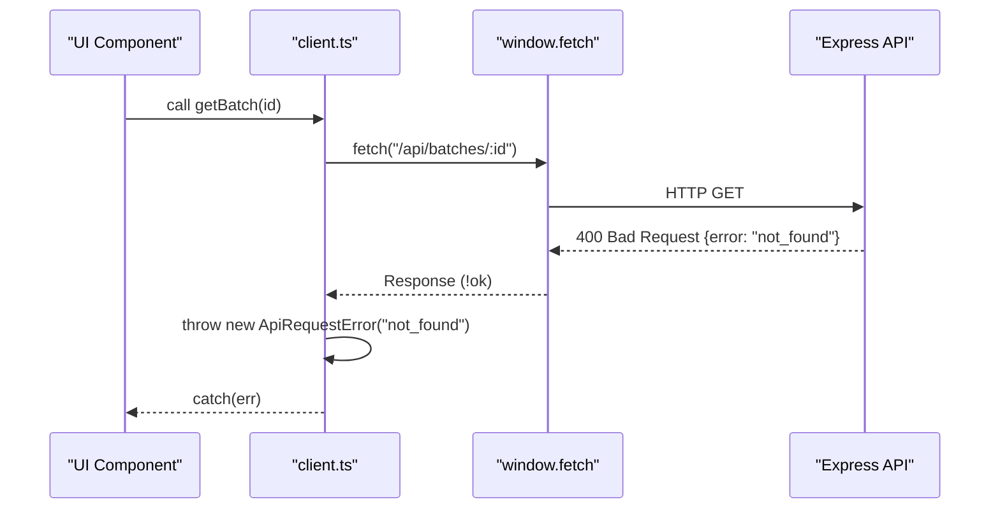
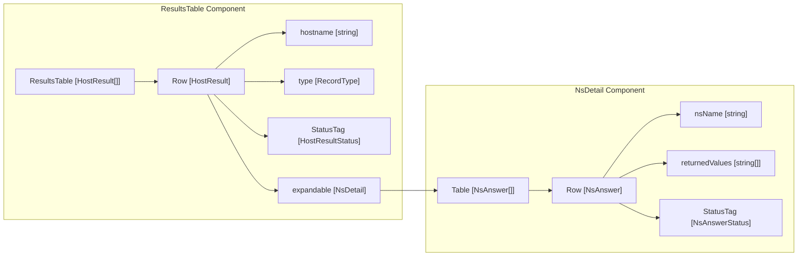

# Shared Components & API Client
Relevant source files
- [web/src/api/client.ts](https://github.com/manuxio/batch-dns-checker/blob/ba4e9a28/web/src/api/client.ts)
- [web/src/api/types.ts](https://github.com/manuxio/batch-dns-checker/blob/ba4e9a28/web/src/api/types.ts)
- [web/src/components/CountsSummary.tsx](https://github.com/manuxio/batch-dns-checker/blob/ba4e9a28/web/src/components/CountsSummary.tsx)
- [web/src/components/ResultsTable.tsx](https://github.com/manuxio/batch-dns-checker/blob/ba4e9a28/web/src/components/ResultsTable.tsx)
- [web/src/components/StatusTag.tsx](https://github.com/manuxio/batch-dns-checker/blob/ba4e9a28/web/src/components/StatusTag.tsx)

This page documents the shared infrastructure of the React frontend, focusing on the typed API client used for server communication and the reusable UI components that provide a consistent look and feel across the application.

## API Client

The frontend communicates with the backend via a central API client module located in `web/src/api/client.ts`. All requests are directed to the `/api` relative path, which is handled by the Vite proxy in development and Nginx in production [web/src/api/client.ts11-13](https://github.com/manuxio/batch-dns-checker/blob/ba4e9a28/web/src/api/client.ts#L11-L13)

### Request Handling & Error Management

The client uses a private `request<T>` helper function to wrap the browser `fetch` API. It provides automatic JSON parsing and specialized error handling through the `ApiRequestError` class [web/src/api/client.ts15-40](https://github.com/manuxio/batch-dns-checker/blob/ba4e9a28/web/src/api/client.ts#L15-L40)

- **ApiRequestError**: Captures the error `code` and optional `details` object returned by the server [web/src/api/client.ts15-22](https://github.com/manuxio/batch-dns-checker/blob/ba4e9a28/web/src/api/client.ts#L15-L22)
- **Response Processing**: Automatically handles `204 No Content` responses by returning `undefined` and parses successful responses as the generic type `T`[web/src/api/client.ts38-39](https://github.com/manuxio/batch-dns-checker/blob/ba4e9a28/web/src/api/client.ts#L38-L39)

### Key Functions

| Function | Endpoint | Description |
| --- | --- | --- |
| `getConfig()` | `GET /config` | Fetches application limits and supported record types [web/src/api/client.ts42-44](https://github.com/manuxio/batch-dns-checker/blob/ba4e9a28/web/src/api/client.ts#L42-L44) |
| `listBatches()` | `GET /batches` | Returns a list of all historical and active batches [web/src/api/client.ts46-48](https://github.com/manuxio/batch-dns-checker/blob/ba4e9a28/web/src/api/client.ts#L46-L48) |
| `createBatch()` | `POST /batches` | Uploads a file and optional name via `FormData` to start a new batch [web/src/api/client.ts64-69](https://github.com/manuxio/batch-dns-checker/blob/ba4e9a28/web/src/api/client.ts#L64-L69) |
| `getBatchProgress()` | `GET /batches/:id/status` | Polling endpoint for real-time progress updates [web/src/api/client.ts54-56](https://github.com/manuxio/batch-dns-checker/blob/ba4e9a28/web/src/api/client.ts#L54-L56) |
| `checkSingle()` | `POST /check` | Executes a synchronous check for a single DNS record [web/src/api/client.ts85-91](https://github.com/manuxio/batch-dns-checker/blob/ba4e9a28/web/src/api/client.ts#L85-L91) |

**Data Flow: API Request Lifecycle**
The following diagram illustrates how a UI component interacts with the API client and how errors are propagated.

**Sources:**[web/src/api/client.ts11-103](https://github.com/manuxio/batch-dns-checker/blob/ba4e9a28/web/src/api/client.ts#L11-L103)[web/src/api/types.ts1-122](https://github.com/manuxio/batch-dns-checker/blob/ba4e9a28/web/src/api/types.ts#L1-L122)

---

## Data Models (Types)

The frontend types in `web/src/api/types.ts` are manually synchronized with the backend's TypeScript interfaces to ensure type safety across the network boundary.

- **HostResult**: The primary data structure representing a single DNS check, containing `nsAnswers` (per-nameserver results), `status`, and `warnings`[web/src/api/types.ts52-65](https://github.com/manuxio/batch-dns-checker/blob/ba4e9a28/web/src/api/types.ts#L52-L65)
- **NsAnswer**: Represents the response from a specific authoritative nameserver, including the `returnedValues` and any specific `error` or `timeout` encountered [web/src/api/types.ts43-50](https://github.com/manuxio/batch-dns-checker/blob/ba4e9a28/web/src/api/types.ts#L43-L50)
- **BatchSummary vs Batch**: `BatchSummary` provides lightweight metadata for lists [web/src/api/types.ts73-85](https://github.com/manuxio/batch-dns-checker/blob/ba4e9a28/web/src/api/types.ts#L73-L85) while `Batch` includes the full array of `results` and `invalidRows`[web/src/api/types.ts87-92](https://github.com/manuxio/batch-dns-checker/blob/ba4e9a28/web/src/api/types.ts#L87-L92)

**Sources:**[web/src/api/types.ts3-122](https://github.com/manuxio/batch-dns-checker/blob/ba4e9a28/web/src/api/types.ts#L3-L122)

---

## Shared UI Components

The application utilizes a set of shared components built on top of Ant Design to visualize DNS data consistently.

### ResultsTable

The `ResultsTable` is the core component for displaying DNS check results. It features an expandable row design to hide technical details unless requested by the user [web/src/components/ResultsTable.tsx48-136](https://github.com/manuxio/batch-dns-checker/blob/ba4e9a28/web/src/components/ResultsTable.tsx#L48-L136)

- **Main Row**: Displays hostname, record type, expected value (with `matchMode` tag), aggregate status, and the list of authoritative nameservers [web/src/components/ResultsTable.tsx51-121](https://github.com/manuxio/batch-dns-checker/blob/ba4e9a28/web/src/components/ResultsTable.tsx#L51-L121)
- **Expandable Detail (`NsDetail`)**: When a row is expanded, it renders a nested table showing exactly what each nameserver returned, its IP address, and its individual status [web/src/components/ResultsTable.tsx8-45](https://github.com/manuxio/batch-dns-checker/blob/ba4e9a28/web/src/components/ResultsTable.tsx#L8-L45)

**Component Structure: ResultsTable**
This diagram maps the visual hierarchy of the results view to the underlying data entities.

### StatusTag

A wrapper around the Ant Design `Tag` component that maps status strings to specific colors and localized labels [web/src/components/StatusTag.tsx24-29](https://github.com/manuxio/batch-dns-checker/blob/ba4e9a28/web/src/components/StatusTag.tsx#L24-L29)

- **Mapping**: It uses two distinct maps: `STATUS_COLORS` for high-level batch/host statuses (e.g., `completed` -> `success`) [web/src/components/StatusTag.tsx4-14](https://github.com/manuxio/batch-dns-checker/blob/ba4e9a28/web/src/components/StatusTag.tsx#L4-L14) and `NS_COLORS` for nameserver-specific outcomes (e.g., `mismatch` -> `error`) [web/src/components/StatusTag.tsx16-21](https://github.com/manuxio/batch-dns-checker/blob/ba4e9a28/web/src/components/StatusTag.tsx#L16-L21)

### CountsSummary

Provides a horizontal list of tags summarizing the counts of `ok`, `warning`, `error`, and `invalid` records [web/src/components/CountsSummary.tsx12-30](https://github.com/manuxio/batch-dns-checker/blob/ba4e9a28/web/src/components/CountsSummary.tsx#L12-L30) It is used in both the Batch view and the History list to provide an immediate visual health check of a batch.

**Sources:**[web/src/components/ResultsTable.tsx1-136](https://github.com/manuxio/batch-dns-checker/blob/ba4e9a28/web/src/components/ResultsTable.tsx#L1-L136)[web/src/components/StatusTag.tsx1-30](https://github.com/manuxio/batch-dns-checker/blob/ba4e9a28/web/src/components/StatusTag.tsx#L1-L30)[web/src/components/CountsSummary.tsx1-31](https://github.com/manuxio/batch-dns-checker/blob/ba4e9a28/web/src/components/CountsSummary.tsx#L1-L31)