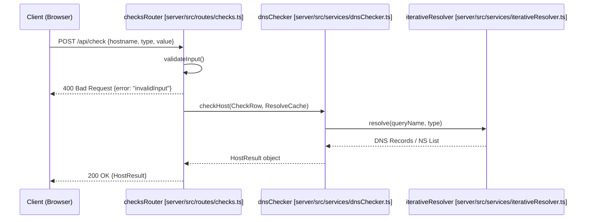
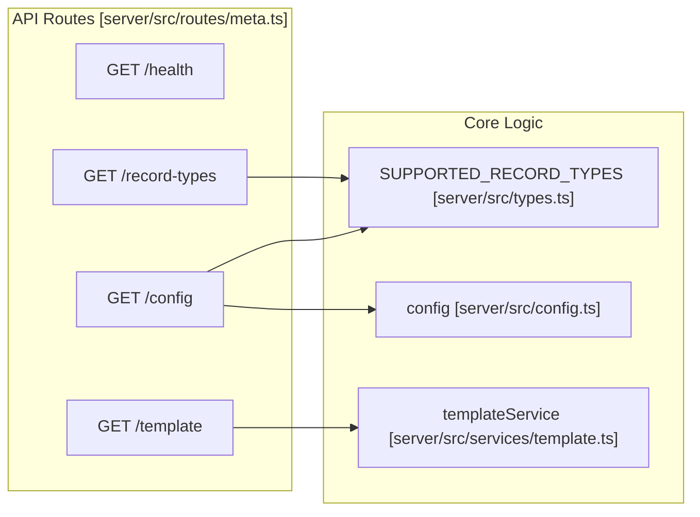

# Single-Check & Meta Endpoints
Relevant source files
- [samples/esempio-dns.csv](https://github.com/manuxio/batch-dns-checker/blob/ba4e9a28/samples/esempio-dns.csv)
- [server/src/routes/checks.ts](https://github.com/manuxio/batch-dns-checker/blob/ba4e9a28/server/src/routes/checks.ts)
- [server/src/routes/meta.ts](https://github.com/manuxio/batch-dns-checker/blob/ba4e9a28/server/src/routes/meta.ts)
- [server/src/types.ts](https://github.com/manuxio/batch-dns-checker/blob/ba4e9a28/server/src/types.ts)

This page documents the auxiliary and synchronous endpoints of the CONI SVC DNS Checker API. Unlike the batch processing system, these endpoints provide immediate responses for single-record verification, system health status, configuration discovery, and resource templates.

## Synchronous Single-Check

The `POST /api/check` endpoint allows users to verify a single DNS record in real-time. This is used by the frontend "Single Check" form to provide immediate feedback without creating a persistent batch job in the SQLite database.

### Implementation Detail

The route handler in `server/src/routes/checks.ts` performs input validation before invoking the core DNS engine. It initializes a fresh, short-lived cache for the request to ensure results are not stale, while still benefiting from memoization during the iterative resolution of that specific host.

### Request Validation Rules

The endpoint enforces the following validation logic:

1. **Hostname**: Must not be empty and must pass the `isValidHostname` regex check [server/src/routes/checks.ts23-24](https://github.com/manuxio/batch-dns-checker/blob/ba4e9a28/server/src/routes/checks.ts#L23-L24)
2. **Record Type**: Must be one of the `SUPPORTED_RECORD_TYPES`[server/src/types.ts6-21](https://github.com/manuxio/batch-dns-checker/blob/ba4e9a28/server/src/types.ts#L6-L21) Input is normalized (e.g., "spf" becomes "SPF") before checking [server/src/routes/checks.ts25-26](https://github.com/manuxio/batch-dns-checker/blob/ba4e9a28/server/src/routes/checks.ts#L25-L26)
3. **Value**: Must not be empty and cannot contain "mixed operators" (combining `&` and `|` in the same string is forbidden to avoid ambiguity) [server/src/routes/checks.ts27-28](https://github.com/manuxio/batch-dns-checker/blob/ba4e9a28/server/src/routes/checks.ts#L27-L28)

### Data Flow: Single Check

The following diagram illustrates the synchronous flow from the API request to the DNS resolution engine.

**Single Check Request Flow**



Sources: [server/src/routes/checks.ts17-44](https://github.com/manuxio/batch-dns-checker/blob/ba4e9a28/server/src/routes/checks.ts#L17-L44)[server/src/services/dnsChecker.ts35-42](https://github.com/manuxio/batch-dns-checker/blob/ba4e9a28/server/src/services/dnsChecker.ts#L35-L42)

---

## Meta & Configuration Endpoints

These endpoints provide metadata about the application state, supported features, and downloadable assets.

### System Health and Discovery

- **GET /api/health**: Returns basic uptime information and versioning [server/src/routes/meta.ts12-14](https://github.com/manuxio/batch-dns-checker/blob/ba4e9a28/server/src/routes/meta.ts#L12-L14)
- **GET /api/record-types**: Returns the list of DNS types the engine can verify, including policy pseudo-types like `DMARC` or `BIMI`[server/src/routes/meta.ts16-19](https://github.com/manuxio/batch-dns-checker/blob/ba4e9a28/server/src/routes/meta.ts#L16-L19)
- **GET /api/config**: Provides the frontend with non-sensitive environment variables (e.g., `softMaxRecords`, `maxBatches`) to adjust UI behavior, such as warning users about large file uploads [server/src/routes/meta.ts22-32](https://github.com/manuxio/batch-dns-checker/blob/ba4e9a28/server/src/routes/meta.ts#L22-L32)

### Template Generation

The **GET /api/template** endpoint dynamically generates sample files for users to fill out. It supports two formats:

1. **CSV**: Returns a UTF-8 encoded string with a Byte Order Mark (BOM) to ensure Microsoft Excel correctly identifies the encoding [server/src/routes/meta.ts43](https://github.com/manuxio/batch-dns-checker/blob/ba4e9a28/server/src/routes/meta.ts#L43-L43)
2. **XLSX**: Returns a binary stream generated by `ExcelJS` via the `buildTemplateXlsx` service [server/src/routes/meta.ts54](https://github.com/manuxio/batch-dns-checker/blob/ba4e9a28/server/src/routes/meta.ts#L54-L54)

**Meta Services Mapping**



Sources: [server/src/routes/meta.ts1-56](https://github.com/manuxio/batch-dns-checker/blob/ba4e9a28/server/src/routes/meta.ts#L1-L56)[server/src/types.ts6-21](https://github.com/manuxio/batch-dns-checker/blob/ba4e9a28/server/src/types.ts#L6-L21)[server/src/config.ts1-35](https://github.com/manuxio/batch-dns-checker/blob/ba4e9a28/server/src/config.ts#L1-L35)

---

## Response Shapes

### HostResult (Single Check Output)

The result of a single check follows the `HostResult` interface, providing an aggregate status and per-nameserver details.

| Property | Type | Description |
| --- | --- | --- |
| `status` | `HostResultStatus` | Final outcome: `ok`, `warning`, or `error`[server/src/types.ts67](https://github.com/manuxio/batch-dns-checker/blob/ba4e9a28/server/src/types.ts#L67-L67) |
| `registrableDomain` | `string` | The base domain used for finding authoritative NS [server/src/types.ts75](https://github.com/manuxio/batch-dns-checker/blob/ba4e9a28/server/src/types.ts#L75-L75) |
| `nsAnswers` | `NsAnswer[]` | Detailed response from every authoritative nameserver found [server/src/types.ts83](https://github.com/manuxio/batch-dns-checker/blob/ba4e9a28/server/src/types.ts#L83-L83) |
| `warnings` | `string[]` | List of issues like "Inconsistent records across NS" [server/src/types.ts86](https://github.com/manuxio/batch-dns-checker/blob/ba4e9a28/server/src/types.ts#L86-L86) |

### Meta Configuration

The `/api/config` response shape is used by the frontend `client.ts` to initialize the application environment.

```
{
  "appName": "CONI SVC DNS Checker",
  "version": "1.0.0",
  "recordTypes": ["A", "AAAA", "MX", "TXT", ...],
  "softMaxRecords": 500,
  "maxBatches": 100,
  "maxUploadBytes": 10485760,
  "dnsMaxRetries": 3
}
```

Sources: [server/src/routes/meta.ts23-31](https://github.com/manuxio/batch-dns-checker/blob/ba4e9a28/server/src/routes/meta.ts#L23-L31)[server/src/types.ts70-88](https://github.com/manuxio/batch-dns-checker/blob/ba4e9a28/server/src/types.ts#L70-L88)