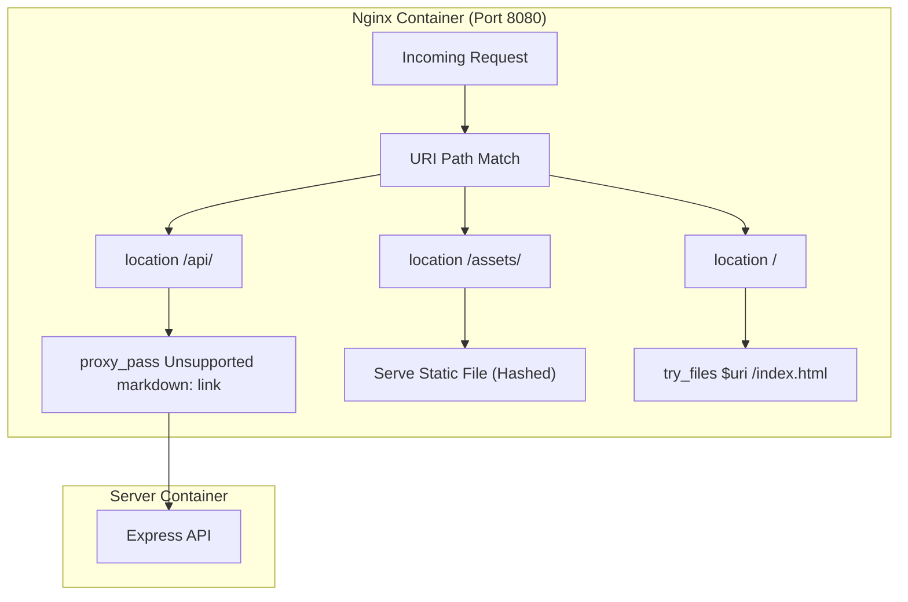
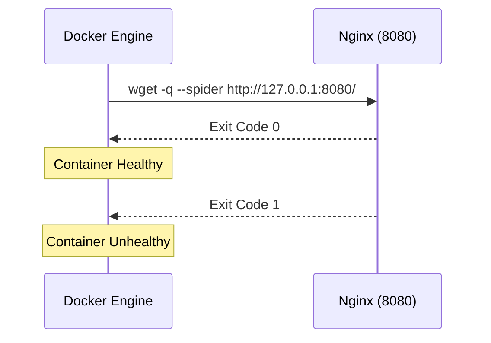

# Web Container & Nginx Configuration
Relevant source files
- [web/Dockerfile](https://github.com/manuxio/batch-dns-checker/blob/ba4e9a28/web/Dockerfile)
- [web/nginx.conf](https://github.com/manuxio/batch-dns-checker/blob/ba4e9a28/web/nginx.conf)
- [web/src/index.css](https://github.com/manuxio/batch-dns-checker/blob/ba4e9a28/web/src/index.css)

The web container provides the frontend infrastructure for the Batch DNS Checker, serving the React Single Page Application (SPA) and acting as a reverse proxy for API requests. It is designed with a focus on security hardening, non-privileged execution, and optimized delivery of static assets.

## Container Architecture

The container follows a multi-stage build process to minimize the final image size and attack surface. It utilizes a `node:20-bookworm` environment for the build phase and transitions to an `nginxinc/nginx-unprivileged:1.27-alpine` runtime.

### Build & Runtime Stages

| Stage | Image | Responsibility |
| --- | --- | --- |
| **Build Stage** | `node:20-bookworm` | Installs dependencies via `npm ci` and executes the Vite build pipeline (`npm run build`) [web/Dockerfile1-9](https://github.com/manuxio/batch-dns-checker/blob/ba4e9a28/web/Dockerfile#L1-L9) |
| **Runtime Stage** | `nginx-unprivileged` | Serves the contents of `/app/dist` from the build stage and handles proxying [web/Dockerfile13-18](https://github.com/manuxio/batch-dns-checker/blob/ba4e9a28/web/Dockerfile#L13-L18) |

### Security Hardening

The runtime environment implements several security best practices:

- **Non-Root Execution**: The container runs as the `nginx` user (UID 101) and listens on port `8080`[web/Dockerfile12-20](https://github.com/manuxio/batch-dns-checker/blob/ba4e9a28/web/Dockerfile#L12-L20)
- **OS Patching**: The `apk upgrade` command is run during image construction to apply security patches for libraries like OpenSSL [web/Dockerfile14-16](https://github.com/manuxio/batch-dns-checker/blob/ba4e9a28/web/Dockerfile#L14-L16)
- **Version Obfuscation**: The `server_tokens off;` directive prevents Nginx from broadcasting its version number in headers [web/nginx.conf11](https://github.com/manuxio/batch-dns-checker/blob/ba4e9a28/web/nginx.conf#L11-L11)

**Sources:**[web/Dockerfile1-24](https://github.com/manuxio/batch-dns-checker/blob/ba4e9a28/web/Dockerfile#L1-L24)[web/nginx.conf8-11](https://github.com/manuxio/batch-dns-checker/blob/ba4e9a28/web/nginx.conf#L8-L11)

## Nginx Configuration & Routing

The `nginx.conf` file defines the behavior for static file serving, client-side routing, and backend proxying.

### Traffic Flow Diagram

This diagram illustrates how the `nginx` process routes incoming requests based on the URI path.

"Request Flow to Code Entities"

**Sources:**[web/nginx.conf20-58](https://github.com/manuxio/batch-dns-checker/blob/ba4e9a28/web/nginx.conf#L20-L58)

### Reverse Proxy & Timeouts

The frontend acts as a gateway to the backend service. Because DNS checks for large batches can be long-running operations, the proxy is configured with an extended timeout:

- **Upstream**: Requests are forwarded to `http://server:3001`[web/nginx.conf27](https://github.com/manuxio/batch-dns-checker/blob/ba4e9a28/web/nginx.conf#L27-L27)
- **Timeout**: `proxy_read_timeout` is set to `300s` to accommodate batch processing latency [web/nginx.conf34](https://github.com/manuxio/batch-dns-checker/blob/ba4e9a28/web/nginx.conf#L34-L34)
- **Payload Size**: `client_max_body_size` is capped at `12m` to support large CSV/XLSX uploads [web/nginx.conf17](https://github.com/manuxio/batch-dns-checker/blob/ba4e9a28/web/nginx.conf#L17-L17)

### SPA Fallback & Caching

To support React Router's client-side navigation (e.g., navigating directly to `/batches/:id`), the configuration uses `try_files` to redirect non-file requests to `index.html`[web/nginx.conf57](https://github.com/manuxio/batch-dns-checker/blob/ba4e9a28/web/nginx.conf#L57-L57)

Assets in the `/assets/` directory (generated by Vite with content hashes) are served with immutable caching headers: `Cache-Control: public, max-age=2592000, immutable`[web/nginx.conf45](https://github.com/manuxio/batch-dns-checker/blob/ba4e9a28/web/nginx.conf#L45-L45)

**Sources:**[web/nginx.conf17-58](https://github.com/manuxio/batch-dns-checker/blob/ba4e9a28/web/nginx.conf#L17-L58)

## Security Headers & CSP

Security headers are applied per-location. This is necessary because Nginx's `add_header` directive does not inherit from the parent context if the child location defines its own `add_header`[web/nginx.conf4-7](https://github.com/manuxio/batch-dns-checker/blob/ba4e9a28/web/nginx.conf#L4-L7)

### Content Security Policy (CSP) Implementation

The application uses two distinct CSP profiles:

1. **Strict Profile (SPA/Assets)**: Applied to the main application and static assets. It restricts `script-src` to `'self'` and disables `frame-ancestors`[web/nginx.conf44-55](https://github.com/manuxio/batch-dns-checker/blob/ba4e9a28/web/nginx.conf#L44-L55)
2. **Relaxed Profile (API/Docs)**: Applied to the `/api/` location to allow the Swagger UI (OpenAPI docs) to function, as it requires `'unsafe-inline'` for styles and scripts [web/nginx.conf25](https://github.com/manuxio/batch-dns-checker/blob/ba4e9a28/web/nginx.conf#L25-L25)

### Header Summary

| Header | Value | Purpose |
| --- | --- | --- |
| `X-Frame-Options` | `DENY` | Prevents clickjacking [web/nginx.conf21](https://github.com/manuxio/batch-dns-checker/blob/ba4e9a28/web/nginx.conf#L21-L21) |
| `X-Content-Type-Options` | `nosniff` | Prevents MIME-type sniffing [web/nginx.conf22](https://github.com/manuxio/batch-dns-checker/blob/ba4e9a28/web/nginx.conf#L22-L22) |
| `Referrer-Policy` | `strict-origin-when-cross-origin` | Protects referrer privacy [web/nginx.conf23](https://github.com/manuxio/batch-dns-checker/blob/ba4e9a28/web/nginx.conf#L23-L23) |
| `Cross-Origin-Opener-Policy` | `same-origin` | Isolates the browsing context [web/nginx.conf43](https://github.com/manuxio/batch-dns-checker/blob/ba4e9a28/web/nginx.conf#L43-L43) |

**Sources:**[web/nginx.conf20-58](https://github.com/manuxio/batch-dns-checker/blob/ba4e9a28/web/nginx.conf#L20-L58)

## Health Checks

The container includes a native Docker health check that uses `wget` to verify the availability of the web server every 30 seconds.

"Health Check Mechanism"

**Sources:**[web/Dockerfile21-22](https://github.com/manuxio/batch-dns-checker/blob/ba4e9a28/web/Dockerfile#L21-L22)